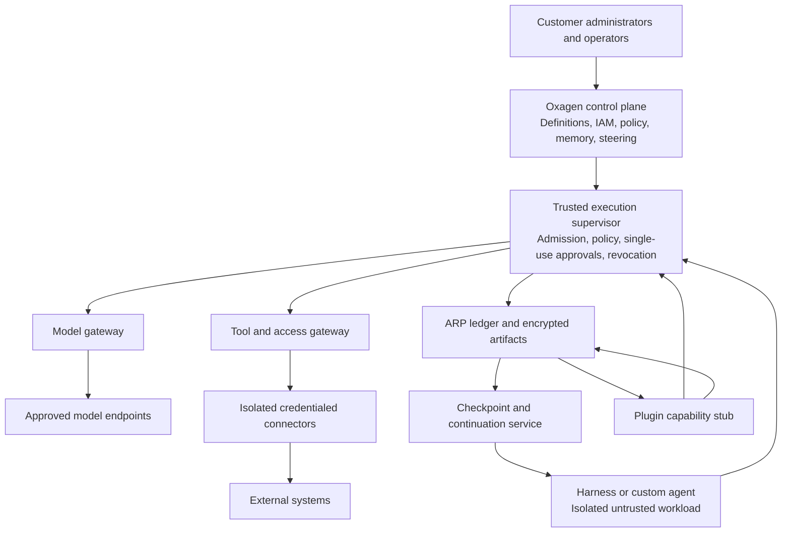

**Agent Run Protocol (ARP) and the Oxagen architecture**

Technical reference • draft 0.2 • 20 September 2026

This is a first-principles proposal, independent of any existing Oxagen implementation. Protocol names, methods, objects, and examples below are proposed interfaces, not claims that a standard or implementation already exists. Vendor capabilities cited here are documentation findings, not integration tests. This revision replaces built-in witness verification with a general partner plugin interface stub. No real plugin, plugin host, witness engine, or marketplace is in scope. See [Oxagen plugin capabilities](../ARP-design.md#17-plugin-controls-in-the-turn-loop).

**1. The architectural decision**

Oxagen should be the operator’s mission control: a web app for assigning work across registered harnesses, reviewing results and spend, and managing access and limits. Its control services own agent definitions and work orders. Its gateways enforce authority on governed model, tool, and context requests. A harness is a replaceable execution frontend. ARP is the open contract connecting those frontends to definitions, execution authority, recorded evidence, and portable continuation.

Customers define agents, identities, instructions, skills, memories, tools, policies, and steering in Oxagen. Oxagen compiles a versioned, authorized projection into each supported harness. It records what was actually delivered and executed, and reconciles that against the intended configuration. A fork preserves the applicable definition and evidence while reauthorizing the destination environment.

Policies, provenance and permissions apply to individual records and individual tool calls. The recommended foundation is OPA for policy evaluation, OpenFGA for object/relationship entitlements, CGP for context retrieval, and ARP for governed execution and continuation. One Oxagen authorization service composes their results; none of the protocols or component engines independently grants execution authority.

**Policies** are the reusable customer-facing rules. Each agent exposes **Permissions & limits**: allowed actions and their bounds. Workspace and organization policies apply across assignments; an agent or run can narrow them. A **governed action** is one checked operation. Single-use authorization is an internal enforcement detail. A required knowledge graph links code, policies, context, and run evidence to their authoritative sources. Future business connectors add real business instances under an ontology. A **work order** binds an assignment to its identity, access, equipment, policy, budget, scope, and review terms. An **authorized continuation** preserves those controls across a saved restart: immutable execution evidence, a reconstructable workspace and context, and a fresh authorization to continue from that state. A conversation export alone is insufficient.

Four product responsibilities follow:

| Responsibility | Oxagen owns | ARP describes |
|---|---|---|
| Definition | Agent, skill, memory, policy, tool and identity registries | Versioned references, manifests, required capabilities and effective projections |
| Control | Work dispatch, work orders, admission, steering, policy decisions, grants and revocation | Target registrations, assignments, launch receipts, commands, barriers, decisions and single-use approvals |
| Execution | Trusted supervisors, gateways, connectors and isolated runners | Action lifecycle, identities, effects, outcomes and receipts |
| Evidence | Run ledger, snapshots, provenance and optional partner evidence | Events, checkpoints, continuation capsules and scoped plugin receipts |

Keep ARP open, versioned and implementation-neutral. Oxagen can be its most complete implementation without making portability depend on an Oxagen-only database or secret file format.

**1A. Mission control and work dispatch**

The web app is the primary operating surface. Its control API receives work requests, assigns them to approved harness targets, and tracks results across the workspace. Mandatory model, tool, and context gateways enforce the current grants and limits. The harness performs the work. A human team supervisor has scoped rights over operators and their work. The local Supervisor is a separate trusted software service.

These are proposed ARP records and operations. They reuse the existing run, policy, approval, budget, pause, evidence, and plugin contracts.

| Record | Required meaning |
|---|---|
| `HarnessTarget` | Stable target ID, tenant/workspace, owning person or team, enrolled device/runner, adapter version, repo bindings, approved releases, placement rules, capacity, presence, and supported controls. Registration alone grants no right to launch. |
| `WorkOrderRevision` | Immutable assignment, issuer, accountable operator, authorized agent and modes, scope, context/tool constraints, policy links, budget references, placement, required capture, expiry, review points, and optional completion conditions. |
| `WorkOrderEnforcementReceipt` | Target, work order revision, effective control sequence/epoch, gates covered, activation outcome, and evidence. A draft or published record is distinct from active enforcement. |
| `WorkRequest` | Submitter, accountable operator, exact agent release/mode/work order, prompt and input references, workspace/repo state, placement options, fixed target set, payer/budget references, queue expiry, start deadline, and required controls. |
| `DispatchTarget` | Stable child request ID, parent request, resolved target, launch ownership epoch, state, failure or waiting reason, cancellation version, and resulting run ID. |
| `LaunchReceipt` | Trusted acknowledgement linking one child request to its run, actual agent release, adapter, repo/files, runtime key, work order, and launch epoch. It proves the recorded start, not task success. |

`work.submit` must explicitly mean new work. Existing-run messages name their run and use steering or a checked next-turn operation. A UI label, free-form prompt, or busy target must not silently change that meaning. Resolve aliases to immutable releases and bind input digests at acceptance. The target must not run a later release merely because an alias changed while work waited.

Authorize the caller for each target, agent, work order, repo, input record, and destination. Keep submitter, accountable operator, and payer distinct and verified. A team supervisor sending on another operator's behalf needs that delegation. Reassignment cannot reset charges or shed applicable operator limits. Do not reveal hidden targets through bulk results. Default bulk admission rejects a changed or unauthorized target set before launch. Explicit partial-admission mode may save individually authorized children and return a safe status for each omitted target. Neither mode promises simultaneous starts or rollback of starts that already happened.

Persist the request, fixed child IDs, and outbound queue records before acknowledging acceptance. An idempotency key names one immutable request within its caller/workspace scope. Reusing it with different content fails. A bounded scheduler chooses only permitted placements, using capacity and isolation requirements. It cannot move a private request, prompt, or context to a public worker just because a private target is unavailable. Rerouting requires an allowed placement choice and fresh checks on the new target.

```text
accepted → queued → assigned → preparing → started
               ↘ waiting for device or capacity
before start: blocked | expired | cancelled | failed
uncertain start: reconciling, with no replacement launch
after start: use the linked run's state and control protocol
```

Each child has at most one current launch owner, enforced by an epoch at the trusted launcher and action gates. A heartbeat timeout does not prove an old owner stopped. A replacement must fence old authority before acquiring control. Start authorization rechecks enrollment, caller/delegation, work order, release, policy, deadline, scope, placement, capacity, and current grants. The first paid action still needs its own budget hold. Reserving a worker slot does not reserve money.

The protected launcher records a stable child-to-run mapping and launch intent before starting a harness. It reconciles that same mapping after a crash. Launch acknowledgement loss must not cause a second process with new authority or a repeated paid first request. If the adapter cannot determine whether launch occurred, the child remains `reconciling` and replacement work is blocked. Existing action receipts govern uncertain effects. Local startup itself must remain in the enrolled isolation boundary.

Order cancellation, expiry, and launch authorization in the child's authoritative state. A cancel committed before launch authorization blocks startup. A launch authorized first may already be starting. In that case cancellation becomes a stop request for the linked run and remains pending until the stop is confirmed. Never report “cancelled, nothing started” without that evidence. Reconnect redelivers stable IDs from saved cursors and rechecks current rights. Closing the web browser does not cancel work.

Each run reports the files it actually received. Two targets sharing a Git remote are not necessarily on the same commit or file state. Use isolated worktrees/work areas by default, or protected writer ownership and version checks for shared files. Shared remote side effects still require record-level checks, duplicate prevention, and conflict handling. Fan-out creates several assignments, not permission to repeat one irreversible write everywhere.

Work orders reference the agent-definition ceiling and cannot widen it. Compose limits by their defined type: denies win, required checks all apply, and narrower resource bounds constrain the action. Apply every relevant budget ledger, with its own period and attribution, rather than taking a naïve minimum across unlike periods. All children sharing one cap reserve against that same ledger. A work order can also limit concurrent work. Acquire capacity atomically across all applicable company, workspace, operator, and agent limits, or acquire none. Each hold names the counted unit, such as an active run, worker, or upstream request. Duplicate delivery reuses that unit’s hold. Separately concurrent attempts need separate holds when the limit counts attempts. Release only after that counted resource stops or is isolated in a way that ends its counted activity. Pausing a run cannot release an upstream-request slot while the provider request still runs. Lost contact alone releases nothing.

Publish work order changes through the existing versioned policy path. Check the issuer before closing gates. Revoke old authority at the effective boundary and record enforcement per target. Stop new spending if a lowered cap is below settled plus held cost, retain outstanding liabilities, and show the excess. A changed operator or agent label does not create a new billing identity. Ongoing work orders use review points and expiry without requiring a false terminal result. The plugin system is optional. When enabled, applicable workspace policy and the work order determine the required seats for an actual completion proposal. A work order cannot omit or waive a seat required by workspace policy.

Partition durable dispatch queues, connection routing, event streams, and report workers by tenant and workspace. Bound queue size, fan-out, active work, and stream traffic. Use fair scheduling and backpressure, with a separate priority path for authorized stop/revoke commands. No global ordering across all customers is required. Keep authoritative order for each assignment/run and atomic reservations across shared budget accounts. Route large encrypted prompt and output payloads by references instead of through the connection broker. Customer-local services apply local root rules and export only permitted fields in hybrid mode.

Dashboards are permission-filtered read views. Each shows freshness, capture gaps, scope, and definitions of its measures. Distinguish settled cost, reserved liability, available funds, unpriced usage, and forecasts. Count each charge once across child/parent views. Measure accepted outputs, rework, retries, waiting time, run time, review time, and cost under stated task filters. Record who or what accepted an output and which checks were used. Cached chart data cannot authorize work, release holds, prove a pause, or decide completion. UI actions go back through current checks and expected-version control commands.

Proposed operations are `target.register`, `target.list`, `target.revoke`, `work.submit`, `work.status`, `work.cancel`, `work_order.publish`, `work_order.assign`, `work_order.status`, and `work_order.revoke`. `work.claim` and `work.start_ack` are trusted worker operations, not operator shortcuts. Future plugin jobs use this same admission and dispatch path under their own scoped grants. No real plugin or marketplace is added by this design.

Acceptance cases must cover multi-harness dispatch, per-target authorization, private placement, duplicate submission and delivery, lost launch receipts, cancel/expiry races, revoked operators, old launcher takeover, shared checkouts, shared money and capacity, work order rollout, stale dashboards, and reconnect after cancellation. Each outcome needs evidence at the target, not just a successful web response.

**1B. Required work reports and tenant storage**

`WorkReport` is a first-class ARP record, with immutable revisions and a current read view for each run/repository pair. It MUST be persisted through the tenant's configured data service into the same authoritative store used for that tenant's Oxagen web-app records. An agent summary, dashboard-only cache, or unacknowledged event queue is not a saved report. This is a proposed protocol requirement, not a claim that a collector is implemented.

| Record or field group | Required contents |
|---|---|
| `WorkReportRevision` | Report ID/revision, tenant/workspace, work request, run/branch/turn scope, accountable operator, work-order revision, data-plane binding revision, source frontier, source observation times, save receipt, completeness, and supersession links. |
| `WorkspaceRepoBinding` | Workspace's linked repo ID, VCS type, provider/host, stable repo ID, safe URL/name, configured default-branch name, settings revision, and rights to resolve that branch. Keep fork/head repo identity separately from the base repo. |
| `BranchComparison` | Work-branch name and commit ID, target branch from the workspace setting and resolved commit ID, comparison kind, file list, patch object reference/digest, collection tool/version/options, capture times, fetch state, and known gaps. |
| `ChangedFile` | Repo-relative path, change type, prior/new path for a rename, old/new blob IDs or captured content references, file modes, binary/submodule markers, and diff completeness. Counts alone cannot replace the list or patch. |
| `PullRequestLink` | Stable provider PR ID, number, URL, state/draft/merge state, head/base repo IDs, branch names and commit IDs, source receipt, observation time, and `target_mismatch`. Support zero, one, or many PRs. |
| `CIJobObservation` | Provider/source ID, job/check ID and name, workflow/run ID, attempt, matrix identity, URL, native status/conclusion, mapped status, start/end/observation times, actual tested commit/ref, test scope, PR association, and update/version evidence. |
| `PersonaUsageSegment` | Approved persona ID, name at use, persona revision, agent ID/release, active mode, runtime, access epoch, and first/last action frontier. A rename or mode change cannot rewrite prior attribution. |
| `ToolUsageRollup` | Unique tool names, confirmed-use totals by name, binding/source/revision breakdown, persona segments, distinct logical action and execution-attempt IDs, and separate denied, sent, successful, failed, and uncertain-start counts. |
| `ReportStoreReceipt` | Tenant/workspace, report/event IDs, configured data-plane/store binding and revision, committed sequence, durable acknowledgement time, artifact references, and integrity data. |

**Data protection.** Scan report payloads locally before remote storage, including patches, paths, URLs, CI text, persona names, and tool labels. Store only cleaned fields and allowed identifiers, with explicit redaction/coverage markers. Required full patches mean full permitted patches, not a right to export secrets. Raw source remains in the local repo; no cloud raw archive or raw content digest is created. Mark exact restoration unavailable when required data was removed.

**Target and diff rules.** Resolve the target from the workspace web-app setting for that linked repository. The required comparison kind is `target_tip_to_work_head`: the tree at the configured default-branch commit is the old side, and the tree at the work-branch commit is the new side. For Git this is `git diff <target_commit> <work_commit>`. A separately labeled `merge_base_to_work_head` comparison may show branch-introduced changes. Store its merge-base ID. It cannot replace the required two-tip comparison. [Git diff semantics](https://git-scm.com/docs/git-diff)

Do not trust moving branch names without object IDs. Resolve the authorized target and work head, then publish the report against a named workspace-settings revision. If the settings changed during collection, retain the observation as superseded and collect a current revision. New commits, force pushes, target advancement, or a newly configured default branch create new report revisions. Never mutate an old patch to make it look current. Failure to fetch the chosen target produces stale/unavailable state, not fallback to a different branch. Detached HEAD and missing/deleted branches have explicit states and nullable names, with known commits retained.

The provider's PR diff may have different semantics. Record it as an optional additional view with its actual endpoints. GitHub's PR comparison uses a merge base. A PR with a different base branch remains linked but sets `target_mismatch`; its checks do not establish compatibility with the Oxagen workspace target. Do not automatically retarget or create a PR as part of reporting. [GitHub comparisons](https://docs.github.com/en/pull-requests/reference/branches)

Capture staged, unstaged, and untracked changes as a separate `WorkingCopySnapshot`, linked to a stable file boundary or labeled non-atomic. A committed branch patch cannot claim to include uncommitted work. Maintain a run-start-to-current view and actor-linked changes for attribution. An inherited branch diff is not proof that the current persona authored all changes. Preserve large/binary content through governed objects rather than silently truncating it. Every file list identifies which comparison or local snapshot it describes.

**Callback capture.** CI webhooks, context responses, tool callbacks, and connector events use the same transient-relay/local-scan contract as model replies. No remote queue, ingress log, trace, graph writer, or retry store may persist their raw payload before scanning. If the enrolled scanner is unavailable, accept only an allowlisted safe envelope of opaque IDs and typed status, or reject delivery so the source can retry. Re-fetch and scan content when the local path recovers. Mark the report pending/stale and preserve known coverage gaps. An external source's own retention remains outside this capture promise.

**CI collection.** Collect every job associated with each tracked PR from all configured CI sources, not just required merge checks or the latest successful workflow. Adapters must exhaust pagination, expand workflows into individual jobs, preserve attempts, and reconcile missed or out-of-order updates with source reads. GitHub requires collection from Checks, Commit Statuses, and Actions jobs where applicable. Keep source-native IDs and map duplicate representations of the same job without collapsing distinct matrix jobs. [GitHub check runs](https://docs.github.com/en/rest/checks/runs), [commit statuses](https://docs.github.com/en/rest/commits/statuses), [workflow jobs](https://docs.github.com/en/rest/actions/workflow-jobs)

Save `coverage = complete | partial | unknown` separately from each job's result, with source inventory, permission gaps, page-completion evidence, observation time, and errors. Complete means all jobs exposed by the configured sources at that observation. It does not promise that no later jobs will appear. A source that exposes only an overall status is insufficient for a complete per-job claim. Never turn no jobs, skipped jobs, inaccessible jobs, or a provider error into “all passed.” Required-check policy and observed-job status remain distinct.

Store the actual commit tested. PR checks can run on a synthetic merge commit, and merge queues can test a merge-group commit. Label `head`, `test_merge`, `merge_group`, or `other` and link the tested head/base inputs where the provider can prove them. Otherwise mark that association unknown. Previous attempts and results for older code remain history, not current success. [GitHub workflow triggers](https://docs.github.com/en/actions/reference/workflows-and-actions/events-that-trigger-workflows)

**Persona and tool counts.** Resolve persona identity from the approved Oxagen registry binding, never from prompt text. Every tool fact joins the binding and persona segment active at that action. `confirmed_use_count` counts distinct execution-attempt IDs with trusted evidence that tool execution began. Success and execution failure both count as use. A rejected proposal does not. A dispatched request whose start is unconfirmed belongs in `uncertain_start_count` until reconciled. Keep sent counts separately so the report does not conceal that uncertainty.

Duplicate event delivery, replay, and stream chunks never add uses. A newly executed retry has a new attempt ID and adds one. The unique-name view sums those facts across binding rows, retains the name used at the time, and exposes each binding/source/revision behind a collision. Whole-tree summaries count each underlying attempt once and label whether child runs are included. Persona-segment totals must reconcile with the same run totals. Reports contain no bearer tokens.

**Storage and updates.** `TenantDataPlaneBinding` is trusted tenant configuration, with backend namespace, region, service identity, key policy, routing version, and approved buffering rules. Web-app writes and report ingest resolve the same binding through trusted services. Database rows and large patch artifacts may use different storage components within that configured data plane. Their references remain tenant-scoped. A private deployment keeps code, paths, diffs, persona details, counts, and CI records in its configured store unless an explicit export rule allows a copy elsewhere.

Save source events and artifact bytes before committing a report revision that relies on them. The durable acknowledgement must cover required artifacts as well as metadata. Build the current read view through a recoverable transaction/outbox or equivalent. Distinguish `collected`, `pending_sync`, `durably_saved`, and `projected`; the UI reports its last applied sequence. Missing required persistence stops new strict-mode dispatch under the existing capture rule. An approved encrypted local spool is bounded and visible as pending. It is not permission to report a central save or silently change storage destination.

Storage changes use an authorized versioned cutover that preserves record IDs, deduplication, ordering, and one authoritative write destination. Delayed callbacks cannot choose a stale or cross-tenant store. Report reads, exports, diffs, names, and counts obey record and source permissions. Refresh on file boundaries, tool/persona events, commits, branch/default-setting changes, pushes, PR lifecycle events, CI updates, and run end. Continue PR/CI tracking after run completion until its stated retention/tracking rule ends, then expose the cutoff. Later facts update the report without silently reopening completed agent work.

A missing PR is `not_created` or `unknown`, as supported by evidence. No applicable repo is `not_applicable` with a reason. A CI outage marks freshness and coverage; it does not claim a passing result. Which missing facts block further work is determined by the current work order and policy. Required report persistence cannot be bypassed by a plugin completion vote.

Proposed operations: `work_report.ingest`, `work_report.refresh`, `work_report.get`, and `work_report.subscribe`. Only trusted collectors/connectors may assert authoritative source facts. Events include `work_report.saved`, `work_report.updated`, `work_report.incomplete`, and `work_report.sync_failed`. Expected revision, stable event IDs, idempotency keys, and configured store binding apply to each write.

Acceptance cases include different workspace/provider/PR defaults; advancing targets and force pushes; uncommitted files and inherited changes; multiple PRs; missing or partial CI permissions; matrix jobs and reruns; old-code success after a new commit; mid-run persona changes; repeated events versus real tool retries; same-name tools from different sources; private-store failure; and an authorized storage cutover with delayed callbacks.

**1C. Shared IAM, model gateway, and row security**

**One permission contract.** `Principal` is a first-class tenant-bound record with human, agent, and service types. Each has a stable ID, lifecycle state, owner where applicable, roles, record grants, and revocation history. Agent identity, persona ID/name/revision, agent release, active mode, runtime identity, accountable operator, and delegation chain are separate fields. A persona label or caller-supplied tenant field is not identity proof.

One authorization service owns the canonical grants and decision contract. The web app, public API, model/tool/context gates, local brokers, plugin seam, background workers, and record service all use it. RBAC provides scoped roles. Record grants and relationships narrow the resources a principal can reach. A delegated action cannot exceed the delegator's grant or the agent definition. Agents do not inherit all operator rights. Service agents need an explicit owner and service grant; they need not depend on a human browser session. Revocation invalidates grants and dependent delegations under a recorded rule.

OpenFGA can evaluate role and record relationships; OPA evaluates rules using trusted facts. These are internal parts of the same customer-facing permission system. An allow from either cannot override a denial from the other. Work-order constraints, active tool belt, current run state, required conditions, data-export rules, and budget reservations also apply. Stateful services reserve funds and consume approvals; a rule-engine result cannot do either. [OpenFGA roles and permissions](https://openfga.dev/docs/modeling/roles-and-permissions), [OPA policy decisions](https://www.openpolicyagent.org/docs/philosophy)

Every decision records principal, delegation, action, resource, purpose, scope, granted view, model/policy revisions, current access epoch, reason codes, and expiry. `GovernedAction` names the logical operation. `ActionAuthorization` approves one exact attempt, not every future use of a tool. Recheck current authority at disclosure or dispatch. Retain the same protections for human actions, services, and agents. Bulk operations must not reveal inaccessible records through counts or errors.

**Real gateway path.** In strict mode the complete, locally inspected provider request passes through the Oxagen model proxy for every governed model call. This includes retries, child agents, summaries, title generation, embeddings, and other background model work. Provider-internal execution is not claimed as visible; admit only features whose access and maximum cost can be bounded. Disable provider-hosted tools that cannot be checked before each action.

The required desktop service assembles and scans the request before remote transmission. The tenant gateway verifies that exact cleaned request, current authority, destination, and budget; persists permitted evidence; consumes the approval once; and dispatches using broker-held credentials. Tenant deployment determines whether that proxy is in SaaS or the customer's private network. Routing must not add content after local inspection. If new content, fields, file bytes, or tool results are introduced, assemble and inspect again locally before release. Safe sign-in headers are added only by the trusted connector and excluded from content records.

Adapters and hooks translate harness events, steering, tool menus, context, and pause boundaries. A before-tool hook enforces a gate only if it covers the path and the governed workload cannot bypass it. After-action hooks only observe. A protected service, sandbox, and network controls block alternate model routes, native tools, other MCP servers, child processes, and credential theft. The app window is not this security boundary. Certify harness/version/feature combinations; an opaque or bypassable route cannot claim strict support. Enforcement on an unmanaged host does not constrain a hostile host administrator.

**RLS and tenant isolation.** Enable PostgreSQL RLS and `FORCE ROW LEVEL SECURITY` on tenant-owned tables. Use a non-owner runtime role without superuser, `BYPASSRLS`, or permission to assume such roles. Keep migration and emergency identities separate and audited. `FORCE` does not stop superusers or `BYPASSRLS` roles. Withhold whole-table privileges such as `TRUNCATE` from normal services. [PostgreSQL row security](https://www.postgresql.org/docs/current/ddl-rowsecurity.html)

Resolve tenant, workspace, principal, and request scope from authenticated server state. Missing scope denies. Set that scope transaction-locally on every pooled connection, including background work. Test commit, rollback, savepoint, error, reconnect, and pool reuse. Do not give agents arbitrary SQL through the application database role: callers able to change session variables can defeat a naïve tenant-variable check. [PostgreSQL transaction-local settings](https://www.postgresql.org/docs/current/sql-set.html)

Use `USING` for existing rows and `WITH CHECK` for inserted or changed rows. The tenant constraint must remain mandatory when policies compose. PostgreSQL combines permissive policies with OR and restrictive policies with AND; test the full policy set. Prevent tenant changes and unauthorized workspace moves. Use tenant-aware joins and foreign keys. Put shared catalogs in deliberately separate tables. [PostgreSQL policy rules](https://www.postgresql.org/docs/current/sql-createpolicy.html)

Use caller-rights views where intended and review privileged functions, triggers, and export paths. A view owned by a stronger role must not silently bypass expected scope. [PostgreSQL view security](https://www.postgresql.org/docs/current/sql-createview.html)

RLS provides a tenant/workspace floor. Fine-grained record and purpose checks remain in the shared authorization service and its trusted query filters; a tenant predicate is not a full OPA policy implementation. The browser uses checked data APIs. It has no privileged database session. Background jobs use scoped service principals; split cross-tenant work into separate authorized tasks. CI ingestion derives scope from a verified connector installation and repository binding, not a workspace value in an event payload.

Apply equivalent checks to object storage, signed links, search/vector indexes, caches, queues, reports, backups, and exports. These are not covered by database RLS. The tenant's configured data plane enforces the same contract in SaaS, hybrid, and private placements. The web app reads the same authorized records used by report writers.

Required tests include human and agent cross-tenant reads/writes, a permitted tool touching a forbidden record, scope leakage across pooled connections, privileged views, stale grants, forged webhooks, unchecked native tools, direct model egress, and a request changed after local scanning.

**1D. Required desktop gateway and local data protection**

Status: proposed architecture. `GovernedAction` names a checked execution. Its authorization is a short-lived, single-use decision bound to the final cleaned request. `WorkOrder` names the assignment and its limits. This contract does not build an app or a scanner.

**Components and trust boundary**

`DesktopUI` signs people in, selects an enrolled workspace, and displays safe status. `DesktopGatewayService` runs independently under a protected service identity. It holds a hardware-backed device key where supported, authenticates local IPC, validates callers and workspace/run bindings, verifies signed policy and update packages, and operates bounded scanners. Agent-controlled processes cannot change its code, rules, identity, or network enforcement.

Enrollment issues a revocable device identity and connects the device to a tenant, permitted workspaces, human principal, and agent runtime. IAM authorizes enrollment and every operation. The UI is not the root of authority. Signed updates require approved publisher identity, version policy, staged rollout, and an atomic rollback or closed state. Disable remote error-upload defaults in service dependencies.

The adapter integrates turn boundaries and tool dispatch. The Supervisor enforces process, file, credential, and network controls. Provider traffic must pass through the local gateway and the tenant's model proxy. Block alternate HTTPS routes, child processes, direct uploads, other proxies, uncontrolled native tools, and unrelated credential sources. Certify this claim per platform and harness version. A host administrator outside the managed boundary can defeat it; do not imply otherwise.

**Data path and order**

1. Resolve tenant/workspace/run/principal identity from trusted enrollment and IAM state.
2. Read the signed `DataProtectionPolicy` revision. Missing, stale, unverified, or incomplete policy denies egress.
3. Accept raw local content into bounded memory. The first outbound boundary is the local scanner, including any Oxagen API submission or telemetry path.
4. Parse and classify each field and attachment locally. Apply block, redact, or safe replacement. Check the transformed result again.
5. Compose the complete provider request locally, including authorized history, system context, memory, tool schemas, steering, files, and remote context. Scan the assembled request and the final serialized fields. Gateway-added prompt content must return to this check. A transport credential is provided separately by the trusted proxy and never becomes model-visible content or evidence.
6. Produce an immutable `SanitizedRequest` and cleaned artifact references. Count tokens, resolve price bounds, reserve budget, and create the GovernedAction authorization from those exact bytes and references.
7. Record the sanitized evidence and consume the authorization atomically at the dispatch gate. Send only this approved request to the tenant proxy, then provider. No component may change model-visible content after this point without a new check and authorization.
8. Apply local outbound checks again before publishing tool output, inbound response excerpts, reports, diffs, or plugin messages. Later content is a new disclosure, not covered by an earlier prompt scan.

If browser-originated work can contain raw sensitive data, the browser must use an authenticated local bridge or an approved local preflight before submitting content to Oxagen. A raw POST to the web app cannot later be described as locally protected before egress. Use a companion-paired bridge with caller authentication, allowed browser origins, CSRF defenses, and a narrow API; being on loopback is not authentication. Disable raw form submission, autosave, upload, session replay, and analytics before this route exists. Do not rely on the user remembering to preclean an ordinary cloud form.

**Policy and transformations**

`DataProtectionPolicy` contains policy ID/revision, tenant/workspace, principal/run applicability, effective and expiry times, classification rules, local detector versions, action per finding, allowed formats, parsing limits, replacement rules, retention controls, and signature. A workspace can narrow inherited rules, not remove a required organization restriction. An urgent revision closes affected admissions and invalidates stale pending authorizations.

`SanitizationResult` contains outcome, scanner/policy revisions, safe finding codes and counts, transformed field references, coverage status, and timestamps. Omit matched text, raw offsets if revealing, raw names, raw content digests, scanner excerpts, and unsanitized exceptions. Hash only cleaned bytes for evidence. Keep any replacement map local and transient by default; use workspace/run-scoped non-meaningful identifiers and never upload a raw lookup map.

Preserve valid JSON, multipart, message role boundaries, and tool-call structure. Do not use string substitution that can alter a tool target, argument meaning, or signed provider envelope without a fresh semantic and authorization check. If required provider signatures or opaque blocks cannot survive safe editing, block the entire request or use an approved alternate workflow. Always revalidate the output schema. A tool's permission to act does not allow exporting its raw results. Verify signed context responses locally, then create a sanitized derivative and a safe verification receipt. Do not claim the changed payload retains the original signature or upload the original/raw digest to prove it.

**Files, cached content, and streams**

Scan every included field, including URLs, filename and path metadata, schema descriptions, MIME attributes, and structured values. Resolve local file references using stable handles and approved workspace scope; reject symlink/path races and file changes between scan and use. Dispatch immutable cleaned copies, not reopened raw paths.

Use sandboxed local parsers and local OCR. Bound bytes, pages, nesting, decompression ratio, output size, memory, CPU, and elapsed time. Archives require complete member coverage within these bounds. Unknown formats, encrypted files, parse failure, unsupported image/audio/video content, active content, incomplete coverage, or detector failure deny by default. Password-assisted unpacking can occur only locally through a protected approved flow, followed by complete scanning. No cloud OCR, remote scanning API, or model-assisted remote detector receives raw input. Detection remains fallible; supported coverage is not proof that a file contains no sensitive information.

A `CleanArtifact` binds cleaned bytes, tenant/workspace, policy/scanner versions, scope, and immutable artifact identity. Create provider file uploads and prompt caches exclusively from these artifacts. Provider IDs are scoped handles, not proof of safety. Reject unproven IDs, raw external upload handles, and stale handles invalidated by new policy. A changed policy may require recheck and regeneration before reuse.

Full-message buffering is the default for outgoing content. A bounded streaming mode requires a supported parser and a rule set proving that already released bytes cannot become a later match. Chunk-by-chunk scanning without cross-boundary protection is forbidden. Cancellation clears raw buffers and leaves only safe status. Metadata sent before body approval must itself pass checks.

**Storage and isolation**

Default: no new raw gateway copies or unmanaged harness transcript persistence. Original source files remain in their existing local repo; scanning neither edits them nor quietly archives copies. No raw content in traces, logs, crash/heap dumps, diagnostic bundles, temporary files, spool queues, model usage probes, hashes, or sync. Disable raw diagnostic capture and use safe structured errors. Control swap/hibernation and crash settings as the platform profile requires; if the profile cannot ensure the stated protection, reject that strict profile or disclose its bounded memory-exposure limit. Never claim guaranteed secure erasure from ordinary process memory.

Optional quarantine is explicit, local-only, encrypted under separate keys, scoped by IAM, time-limited, and excluded from sync and automatic diagnostics. Off by default. Record safe access events. Raw diagnostic exports are a distinct exceptional operation, never an implied consequence of enabling telemetry.

Separate workspace queues, keys, caches, replacement state, parser jobs, and artifacts. Recheck the authenticated scope at dispatch. A blocked request can emit a safe decision event, never the original payload. Persist cleaned evidence in the tenant's configured data plane; no public-cloud fallback for private-store failure. This covers VCS diffs, paths, work reports, and portable snapshots. Mark sanitization gaps and reduced replay fidelity; required reporting does not authorize exporting raw source. Gateway-held authentication secrets are used only in authorized transport/connector paths and are excluded from content scans' diagnostic output and all evidence.


The tenant proxy must not persist an unscanned model response in a remote log or trace. Relay it through bounded transient buffers to the enrolled local gateway for the required scan. Commit only the cleaned response and safe usage metadata to remote evidence before dependent execution. If that path is unavailable, hold or stop delivery under the capture rules. This requirement includes provider errors and streamed replies; raw debug capture must remain disabled. The customer controls provider-side retention separately; local filtering cannot erase information already held by an external provider.


**Proof of local inspection.** A signed `ScanReceipt` binds the enrolled gateway identity, trusted workspace/run scope, policy and detector revisions, complete-coverage status, final cleaned request digest, immutable cleaned artifact references, destination, and expiry. The tenant proxy requires a current receipt from an authorized gateway and checks it against the received request. A caller-supplied `scanned: true` flag is never proof. Reusing a receipt for changed bytes or a new unauthorized scope fails. Signature validity proves the named scanner reported the result, not that detection is infallible. Device management and platform checks establish the trusted scanner boundary. No raw content digest enters this receipt.

**Desktop lifecycle.** Certify macOS, Windows, and Linux builds separately. A required-platform capability failure prevents strict launch. Remote/headless runners install the equivalent protected gateway on the data's host. Enrollment, workspace selection, repo binding, target registration, data-rule preview, access requests, health, and signed updates are required UI/API flows. The local preview never uploads its original. Leaving a workspace revokes local grants and clears scoped transient state. Service failure leaves egress closed; recovery reconciles prior sends. Managed uninstall stops or isolates governed work before removing controls. An offline status cannot prove a confirmed pause.

**Required tests**

Test secrets across chunks, fields, encodings, filenames, tool schemas, history, OCR, and nested archives. Test encrypted/unknown formats and parser limits. Test guessed provider file/cache IDs, raw uploads, changed files after scan, symlink swaps, policy expiry/revocation, cross-workspace cache reuse, retries, blocked direct network paths, and background calls. Inject failures into scanners, telemetry, logging, crashes, pool reuse, sync, and dispatch. Capture all test egress and inspect persisted records to prove that planted raw markers never leave. Verify budget and authorization bind final cleaned bytes. Test exact sanitized replay and explicit original-input gaps.

**1E. Business policy and shared action limits**

This is a proposed design, not an implemented refund system. Customer-facing names are **Policies** and agent **Permissions & limits**. A `WorkOrder` carries assignment scope and may narrow limits. A `GovernedAction` is checked execution; its single-use authorization is internal infrastructure, not a customer configuration object.

#### Policy definitions and effective limits

Provide versioned `PolicyTemplate` forms with validated typed fields, previews, examples, and tests. Compile forms into a normalized policy model and the chosen evaluation backend. Rego is an advanced authoring option, not a required customer skill. Preserve the template revision, resolved values, source policy, approval history, and activation time. One IAM layer governs policy changes, tool use, affected records, exception decisions, and disclosure of evidence.

Bind rules to a stable business capability such as `refund.issue`, its approved tool bindings, connector operations, and protected effects. Tool aliases or a renamed function cannot change this mapping. An unknown implementation cannot inherit access because its name matches. Use the same enforcement for human-triggered and agent-triggered governed refunds.

Effective authority is the intersection of organization, workspace, agent, delegated grant, and current work-order constraints. All applicable limits pass independently. A narrower scope cannot raise a parent ceiling. Distinguish absolute prohibitions, hard numeric caps, and explicitly overridable approval thresholds. Do not represent them with an ambiguous single limit field.

#### Refund example and monetary meaning

Illustrative rules: cumulative order refunds ≤20% of eligible paid order amount; refunds per canonical customer per workspace per day ≤USD100; all workspace refunds per day ≤USD5,000. A product label must expose the full scope, not silently imply organization-wide customer coverage. Organization-wide rules need organization-wide customer identity and accounting.

Define eligible order amount from authoritative captured charges, explicit tax/shipping/discount rules, and currency. Prior refunds reduce remaining allowance; they do not become a new denominator. A changed charge requires a new authoritative amount version and reevaluation. Use integer minor units and a declared rounding rule. Either require a common currency or pin an approved conversion quote and conservative reservation bound. Never add mixed-currency figures directly.

Use a named IANA time zone and calendar day, or an explicitly selected rolling interval. Define the event time that charges a period. For example, calendar-day limits count authorized dispatch time from the trusted clock; external refunds need an equivalent authoritative initiation time. Recheck the period immediately before dispatch. If it changed, acquire the new period's reservation before releasing the old one. Unknown times or untrusted history block a strict all-refunds claim.

#### Atomic admission and settlement

A protected refund service obtains current order/customer identity, refundable balance, refund history, policy revisions, and scope. It atomically reserves capacity in every applicable limit account before external dispatch. Admission requires `settled + held + proposed ≤ cap` for each account. Policy evaluation alone is not a reservation. Refund exposure and model-spend budgets are separate ledgers even if they share infrastructure.

Create a durable action and attempt record, reserve once, then dispatch using a stable provider idempotency key where supported. Retries retain logical operation identity and reconcile previous attempts first. Ledger postings have unique authoritative refund/event identities. Duplicate webhooks or observations cannot count twice. Do not promise exactly-once external effects unless the provider contract supports the needed guarantee.

A confirmed failure before any effect releases its hold. Timeouts, cancellation, run completion, missing receipts, and uncertain outcomes retain potential liability. On authoritative settlement, replace the hold with the actual charge and release only the verified remainder. Refund reversals or corrections change allowance only through a policy-defined, authoritative adjustment, never through a claimed failed status.

Reconcile external refunds too. Strict global limits require source-system enforcement or serialization of every refund path. Polling and webhooks alone cannot eliminate races with outside actors. Otherwise label the limit as covering Oxagen-admitted activity, include observed external exposure conservatively, and block when required history is incomplete.

#### Exceptions, gates, and product evidence

An `ExceptionGrant` binds the authorized approver, exact action/facts, named overridable threshold, maximum amount, scope, expiry, reason, and policy revision. It cannot waive an absolute prohibition or higher hard cap. Pending approval creates no right to dispatch. Any temporary hold remains explicit and expiring; after approval recheck facts, rights, policy, periods, and available capacity before acquiring or confirming all holds.

The trusted tool/connector service enforces these checks before the payment API call. Protect its credentials and block alternate refund routes. Model-call proxying does not enforce business-tool effects by itself. The app shows effective sources, used/held/remaining values, freshness, scope, and safe denial explanations. Save decision and settlement evidence in the tenant's configured store under the local data-protection rules.

**2. Guarantees and their limits**

Define the product's guarantees precisely at admission time.

| Operation | Contract |
|---|---|
| Playback | Render recorded events and state without executing any effects. |
| Deterministic replay | Reconstruct supported orchestration using recorded model outputs, tool results and other nondeterministic inputs. |
| Native recovery | Resume a compatible harness/runtime checkpoint when that runtime supports it. |
| Portable continuation | Start a different harness with preserved observable context, workspace, pending work and newly authorized access. |
| Migration | Transfer execution ownership; fence the source before activating the destination. |
| Fork | Create an independent branch; the source may continue, subject to resource and effect isolation. |

Portable continuation cannot promise the same future model behavior. Model-private state, native reasoning artifacts, inference caches, tokenization, system instructions and harness internals can be unavailable or incompatible. OpenAI and Anthropic document provider-specific reasoning/continuation state; that state is not equivalent to a readable transcript. Preserve authorized opaque artifacts for compatible native recovery, and declare their loss when crossing providers. [OpenAI reasoning](https://developers.openai.com/api/docs/guides/reasoning), [Claude thinking](https://platform.claude.com/docs/en/build-with-claude/thinking)

“Everything” means every relevant interaction within a declared capture boundary. It does not mean unseen model internals or arbitrary activity on an unmanaged computer. Human editor changes, external resource changes and file mutations that affect an agent still need capture even in an agent-focused recording. Actor filtering belongs in the view/export policy; dropping causal inputs undermines continuation.

Publish separate assurance dimensions rather than one misleading fidelity percentage:

| Dimension | Example values |
|---|---|
| Control | observed, cooperative, enforced, attested |
| Capture | complete-within-declared-boundary, gaps, metadata-only |
| Continuation | native-compatible, portable-transformed, blocked |
| Environment | filesystem-restored, runtime-restored, external-state-unavailable |
| Plugin decisions | disabled, pending, required-ready, held, continued, waived |

An unmanaged laptop cannot provide enforcement against its administrator. An arbitrary vendor-hosted agent cannot provide mandatory model mediation unless the vendor exposes and honors the necessary boundary. Support those integrations honestly at their available assurance level.

**3. Oxagen as the system of record**

Use immutable revisions and explicit release objects. Separate the stable logical identity of an agent from its changing definition and from each runtime instance.

| Object | Essential contents |
|---|---|
| `AgentDefinition` | Purpose, owner, logical identity, behavior instructions, skill dependencies, model constraints, explicit tool allow/deny lists, approved mode subsets, memory views, delegation limits and required assurance |
| `AgentRelease` | Immutable resolution of a definition, dependency digests, schemas, instruction templates, memory-view configuration and compiler compatibility |
| `SkillPackage` | Instructions, optional executable assets, dependencies, declared required capabilities, publisher, provenance, tests and content digest |
| `PolicyBundle` | Versioned authorization rules, schema, resource facts, approval rules, export restrictions and emergency deny constraints |
| `ToolBinding` | Stable tool ID, publisher, tenant/workspace scope, schema and route revisions, effects, resource constraints, credentials, and retry contract |
| `RunContextBinding` | Verified organization, workspace, operator, agent release, active mode, runtime, run, and authority epoch |
| `ToolBeltSnapshot` | Resolved allowed bindings, policy/grant revisions, visible schema digest, adapter projection, and activation state |
| `MemoryRecord` | Content, subject, source evidence, author, scope, classification, validity/freshness, revision, retention and promotion state |
| `MemoryView` | Authorized query definition over memories; allowed scopes, freshness, ranking, token budget and destination restrictions |
| `SteeringDirective` | Authorized issuer, target, trigger, effective boundary, priority, expiry, expected revision and acknowledgement state |
| `IdentityBinding` | Owner, human/workload association, delegation ancestry, allowed responsibilities and lifecycle state |
| `EffectiveRunManifest` | The exact release, policy epoch, skill set, memory reads, tool catalog, harness projection and enforced restrictions used by a run |

Instructions can describe desirable behavior. They do not confer authority. A skill that requests network access has declared a dependency; it has not granted itself network access. Memory cannot create IAM privileges. A model's plan cannot amend policy.

Store definitions in a transactional registry with append-only change history and content-addressed release artifacts. Human-friendly names such as `production` may point to releases, but a running request always records resolved immutable digests.

Provide administrative RBAC, reviewable changes, staged rollouts, rollback, approval workflows for sensitive changes, and an audit trail of who changed what. Imports from local harness configuration produce proposed revisions with provenance. They must not silently become authoritative organization policy.

**4. A compiler and reconciler for every harness**

The harness compiler takes an `AgentRelease`, current authorization constraints, a memory view, a run state and target capabilities. It emits a `HarnessProjection` containing actual instructions, tool schemas, skill packages, allowed resources, memory excerpts, model configuration and adapter settings.

Every projection also contains:

- A mapping from source records to generated material and their authority/trust levels.
- Compiler and adapter versions, hashes and target harness version.
- Required capabilities, what is natively supported, what is emulated and what is unsupported.
- A transformation report covering role mapping, omitted material, truncation, summaries and incompatible state.
- Effective enforceable constraints and configuration evidence from the runner.

Required security capabilities that cannot be satisfied cause admission failure. Optional behavioral differences can be accepted under tenant policy and must be visible. The compiler may not silently replace a required capability with an instruction telling the agent to behave.

Use a reconciler to compare intended state with observed state at startup and each model boundary. Protect deployed configuration from agent writes. If a harness allows dynamic tool or instruction changes, apply them through its supported interface. Otherwise restart or continue in a newly hydrated session. Record that transition explicitly.

Pin agent/skill releases for reproducibility. Allow customer-selected update policies such as next-turn, checkpoint, or manual adoption. Security revocations and emergency denies apply at the next enforceable authorization boundary regardless of the pinned behavioral release. Historical policy records explain old actions; they never authorize new actions after a fork.

The promise is **one governed definition across runtimes**, not identical behavior across all models.

**5. Memory is a governed data system**

Separate episodic evidence, proposed durable knowledge, approved shared knowledge and procedural skills. A vector database is a search index over canonical records, not the source of truth.

Each memory needs source links, scope, trust classification, ownership, creation and observation times, expiry/freshness, and retention. A claim such as “tests pass” must refer to a test receipt and exact tree digest. Agent-generated summaries remain derived claims, not upgraded facts.

Model memory writes as proposals. Promotion into project/team/organization memory requires a policy-approved workflow and, for sensitive material, review or independent evidence. Prevent an agent from poisoning shared memory merely by repeating a claim across runs. Retrieval must preserve trust labels and never elevate retrieved instructions into higher-priority policy.

Memory reads are authorized operations. Log the actual records and versions returned, the query/view revision and the excerpts ultimately delivered to the model. Replaying retrieval from the current index is not an acceptable substitute for recording the original result.

At a fork, give the child a branch-local memory overlay over a pinned memory view. Offer explicit frozen versus live reads; record every live refresh. Shared memory promotion uses conflict detection and provenance-aware review. Do not automatically merge memories when code branches merge.

Deletion, access revocation and classification changes must propagate to indexes, embeddings, summaries, caches, exports and future context compilation. Existing external model disclosures cannot be retroactively erased by revoking access, so export authorization must happen before the request leaves the data plane.

**5A. Context Graph Protocol is the context interface**

Integrate `macanderson/context-graph-protocol` as a first-class retrieval interface. Its normative specification describes typed context frames with provenance, budget accounting, consent and temporal metadata. Its governance explicitly leaves fleet authorization and organizational policy outside its scope. That gives a useful division: CGP exchanges retrieval evidence; Oxagen decides who may retrieve and disclose it; ARP records how it influenced execution. [CGP specification](https://github.com/macanderson/context-graph-protocol/blob/main/SPEC.md), [CGP governance](https://github.com/macanderson/context-graph-protocol/blob/main/GOVERNANCE.md)

Build an Oxagen Context Gateway that uses the required knowledge graph for discovery, acts as a CGP host toward providers, and offers an authorized context service toward harness adapters and Oxagen MCP. Fetch exact underlying source versions under the same IAM checks; a graph hit does not grant access. Expose Oxagen memories, approved knowledge and searchable run evidence through CGP providers. Keep agent instructions and executable skill authority in signed releases; a retrieved frame naming a skill is still data, not permission to install or execute it.

The retrieval flow should be:

1. Authenticate the runtime and establish purpose, run scope and eventual model destination.
2. Authorize the query and any query-data disclosure before contacting an external provider, embedding service or reranker.
3. Verify provider identity, allowed capabilities, consent and deployment policy.
4. Retrieve with tenant/resource filters and enforce the negotiated CGP contract.
5. Authorize every returned record and selected view, including provenance disclosures and source restrictions.
6. Validate available provenance, freshness and budget evidence; quarantine unresolved restricted references.
7. Apply approved transformations and produce derived frames with their own provenance.
8. Authorize the final context export to the destination model and commit the exact selected bytes and references into the ARP context manifest.

Consent and RBAC are cumulative requirements. Provider consent does not grant access to every record behind that provider; record access does not imply permission to send the query or response to an external model. The provider's service identity is also distinct from the requesting agent's identity.

Define an **ARP–CGP binding profile**, without silently changing CGP's base wire contract. ARP carries query/response artifact references, provider identity, pinned CGP/schema version, run/turn/request IDs, frame IDs and content digests, source record revisions, consent and decision references, selection/transformation evidence, and final prompt spans. Authentication context belongs in an authenticated transport or negotiated extension; an unsigned tenant ID in a query is not authority.

Keep a retrieval receipt for what a provider returned and a separate composition receipt for what Oxagen actually inserted into the ordered model request. This allows an auditor to distinguish retrieved, selected, delivered and subsequently cited material. Delivery establishes available input, not proof of a model's internal causal reasoning.

Verify original context responses and attestations locally, using signing keys trusted through the tenant registry and workload PKI. Remote evidence receives only allowed sanitized derivatives and a safe verification receipt. Do not export a prohibited original or raw content digest. Do not claim that a changed payload retains its source signature. Record verification coverage and resulting provenance limits.

Maintain two budgets: CGP's specified accounting rule for retrieval conformance, and the target model's token budget for the fully assembled request, including instructions, tools, wrappers and reserved output. CGP's canonical content unit uses `ceil(UTF8 bytes / 4)`; it is not the target model's tokenizer and does not budget the entire assembled prompt. [CGP core concepts](https://contextgraphprotocol.org/docs/concepts)

Reference frames need authorized dereferencing at use time. The current 1.0 specification does not define a `context/resolve` wire message; Oxagen's own `context.resolve` operation must remain an ARP/host service or a separately negotiated future extension. Declared temporal validity and `as_of` are useful retrieval constraints, not proof that an external source is immutable or truthful. [CGP specification, reference frames and attestations](https://github.com/macanderson/context-graph-protocol/blob/main/SPEC.md)

Pin the normative repository specification, schema and conformance suite by commit/release. At research time, the repository states `contextgraph/1.0` while the website introduction still states `1.0-draft`; use the pinned normative artifacts for compatibility claims. No broad production-adoption claim is established here. [CGP repository](https://github.com/macanderson/context-graph-protocol), [CGP website introduction](https://contextgraphprotocol.org/docs)

The inspected repository snapshot is `c13ede1527d840cf39bff2f4ab9838efd7a1aa8f`. Use that immutable snapshot to review this proposal's mapping, then deliberately select/update the release for implementation. [Pinned CGP specification](https://github.com/macanderson/context-graph-protocol/blob/c13ede1527d840cf39bff2f4ab9838efd7a1aa8f/SPEC.md)

Keep the optional `contextgraph/lifecycle/1.0-draft` record profile distinct from core 1.0. It can represent useful contextual constraints and reference external execution approval; its records must not become execution single-use approvals. Bind lifecycle-record references to ARP policy/plugin records through an explicit optional profile and test its schema separately. [CGP lifecycle record definitions](https://github.com/macanderson/context-graph-protocol/blob/c13ede1527d840cf39bff2f4ab9838efd7a1aa8f/contextgraph-types/src/record.rs)

Run CGP's conformance suite plus Oxagen-specific tests for tenant isolation, per-record denial, consent revocation, forged signer identities, unauthorized references, budget mismatch, malicious content and stale source permissions. A conformance pass demonstrates tested protocol behavior, not universal data truth or comprehensive egress enforcement.

**5B. The required knowledge graph foundation**

### Required knowledge graph and source contract

The knowledge graph is a required discovery and relationship layer for code, business ontology, governance, context, and run evidence. Future business connectors add actual entity instances. Keep source authority explicit: VCS owns file/history facts; CRM and payment systems own their records; Oxagen owns approved policies, IAM records, and execution evidence. A graph projection does not acquire authority merely by copying a record. Separate authorization relationships from knowledge/provenance relationships logically, even if storage is shared. `derived_from`, `mentions`, or `caused_by` must never imply `can_read` or `can_invoke`.

Define the following records now:

| Record | Required content |
| --- | --- |
| `GraphEntity` / `GraphEntityRevision` | Tenant-scoped opaque ID, entity type, immutable revision, source authority and binding, exact source version, safe source reference, classification, source-permission dependencies, trust state, observed time, validity time, transformation references. |
| `GraphRelation` / `GraphRelationRevision` | Tenant-scoped ID; exact endpoint revisions; typed relationship; provenance and evidence; proposed, inferred, or verified status; independent field/edge access restrictions. |
| `GraphProjectionState` | Source binding, requested and applied source versions, checkpoint, sync state, observation time, safe error code, policy/access epoch, deletion state. |
| `OntologyRevision` | Versioned entity/relationship definitions, source-field mappings, validation rules, ownership, and approved migration plan. |
| `BusinessActionCorrelation` | Run/trace, governed action and execution-attempt IDs; decision/policy references; applicable approval; trusted connector binding and receipt; source-native record identity/version; correlation provenance and status. |

IDs are scoped by tenant and source installation. A provider record ID alone is not globally unique. Preserve source-native identity inside permissioned bindings rather than exposing it in public URLs. Code entities bind repository identity, commit, path, and symbol identity; retain rename/move lineage without claiming symbols have universally stable identifiers. Context records bind authoritative revisions and any sanitized derivative separately. An unavailable source version remains unavailable, not silently replaced with current content.

### Projection, access, and retrieval

Use durable change events plus reconciliation to update projections. Make consumers idempotent; order updates within each source, reject stale overwrite, and represent deletes/revocations with tombstones and access barriers. A projection checkpoint describes its observed source state, not a global atomic snapshot across unrelated systems. Branches and forks retain their selected source revisions. Enforce deletion and access changes across graph stores, embeddings, caches, search indexes, and derived results.

Oxagen MCP discovery uses the Context Gateway and graph. Authorize the query, search permitted scope, check nodes/edges/properties and derived results, dereference allowed source versions, then apply final disclosure/export checks. Reuse the existing ARP–CGP binding for returned frames and retrieval/composition receipts; do not invent a replacement CGP wire protocol. The graph store API remains an Oxagen internal contract, while CGP exchanges selected context.

Use the same human/agent IAM principal, RBAC grants, resource permissions, purpose, destination, and authorization epoch throughout. Tenant/workspace row-level security provides a database floor where applicable; graph traversals and non-SQL indexes still need explicit scope enforcement. Protect counts, existence, path explanations, and edge properties. Derived access is no broader than the allowed intersection of its sources. Filter within the trusted boundary before external embeddings, ranking, or models see data. Recheck before response delivery; a cached graph path is not a reusable access grant.

Only allowed sanitized derivatives enter the graph. Local protection precedes network export, indexing, telemetry, and remote buffering. Node labels, source references, fingerprints, diagnostic fields, and correlation metadata must not carry prohibited originals. Use opaque local receipt references when raw-content hashes would disclose protected content. Retain transformation provenance without claiming raw replay or preserving a signature over changed bytes.

Policy discovery and policy enforcement remain separate. The action gate loads current approved policy revisions and authoritative business facts. It may use verified graph references to locate them, but never stale projections or inferred links as authorization. Fail closed if required current facts cannot be established.

### Future business evidence

Future connectors ingest actual `Refund`, `Order`, and `Customer` instances under approved ontology mappings. Link exact run/trace and tool attempt → evaluated policy revision and decision → required human approval → connector execution receipt → source-confirmed refund → order/customer. Link policy revisions to relevant files, code symbols, tools, context, tests, and evidence with a stated relation and trust level.

Correlation requires a trusted connector-returned source identity or verified source event joined to a recorded idempotency/correlation key. Agent assertions and approximate amount/time matching remain unverified proposals. Track requested, pending, failed, and confirmed states per attempt; a tool's success text alone does not prove an external refund. Reconcile later provider updates, including reversal or cancellation, as new evidence. Preserve the policy evaluated when execution occurred and the separate current policy.

Scope now: mandatory graph/discovery contracts, stable identifiers, version/provenance records, access enforcement, safe projection events, and correlation slots. Future scope: business connector implementations, ontology-instance ingestion, business reconciliation workflows, and outcome analysis screens. Test tenant isolation, denied edges/counts, stale-policy rejection, projection lag, duplicate/out-of-order events, revoked sources, forged correlations, and sanitized-only indexing before claiming support.

**6. Physical architecture and trust boundaries**



These are logical boundaries, not a requirement to launch dozens of microservices immediately. The security boundary between agent-controlled execution and trusted supervision is mandatory from the beginning.

The control plane owns desired state, identity, policy administration, releases, steering, access workflows and run orchestration. The regional or customer-local data plane owns synchronous enforcement, model/tool traffic, credential use, durable action receipts, workspace capture and payload storage.

Place the trusted supervisor outside the agent's sandbox. It must retain authority if the agent process, repository code, installed packages, MCP server or shell is malicious. A library injected into the agent process is not that boundary.

Use one isolated microVM per untrusted run/compartment where practical. Keep connectors in separate compartments with narrower access. Provide immutable images, encrypted ephemeral volumes, resource quotas, restricted mounts, no host container socket, no ambient cloud credentials and no access to supervisor keys. A sandbox and egress controls are separate requirements: sandboxing alone does not remove networking. [gVisor security model](https://gvisor.dev/docs/architecture_guide/security/)

Default-deny egress must cover direct IP access, DNS, IPv6, redirects, metadata endpoints, host interfaces, local sockets, tunnels and child processes. An allowlisted general-purpose HTTP proxy can still be an exfiltration path; authorize destinations, operations and relevant payload classes at the application gateway. Packet inspection is supporting evidence, not a replacement for application-level mediation.

Tools executed by the model provider require special handling. If Oxagen cannot authorize each hosted tool action before execution, strict mode must disable that feature or replace it with an Oxagen connector. The same applies to remote subagents and vendor-hosted execution environments outside the controlled boundary.

**7. The small trusted execution kernel**

Make the authorization/dispatch kernel small enough to model-check and audit. It should own admission, revision checks, identity binding, policy decisions, single-use approvals, resource leases, dispatch receipts, fencing, and capture barriers. It should not implement the model's reasoning loop or every connector's business logic.

Its central invariant is:

> No governed operation is dispatched without a durable intent, a current authorization for that exact operation, and a dispatch record bound to the executing identity.

Model inference, tool execution, memory access, context export, child-agent creation, credential grants and artifact publication are governed operations. A customer can configure automatic authorization for ordinary operations; “ask Oxagen” need not mean interrupting a human for every inference.

A model call follows this sequence:

1. Authenticate the runtime and resolve tenant, run, agent release and branch server-side.
2. Apply due steering and build the effective context/tool manifest.
3. Assemble and inspect the full outgoing request in the protected local gateway. Apply workspace block/redact/replace rules before any remote transmission or recording. Verify data export rules, model/provider/region, budget, skills, tools and current policy epoch against the cleaned request.
4. Persist intent and policy decision; reserve required budget.
5. Issue and consume a short-lived approval for this governed action at the model gateway. Bind it to the exact locally cleaned request.
6. Dispatch the authorized native provider request with gateway-held credentials.
7. Relay replies through the required local scan, record only cleaned stream segments and outcome, account usage, and commit permitted results before dependent actions.

A tool action follows the same structure, adding resource preconditions, execution isolation, a connector effect contract and reconciliation of external outcomes.

Signed single-use approvals must bind tenant, logical agent, runtime key, run, branch, action, audience, exact request digest, tool/connector version, resource constraints, policy revision, context revision, fencing epoch, expiry and consumption limit. The verifier must atomically consume the approval; a signature alone does not stop replay. Do not store live bearer single-use approvals in portable run bundles.

Commit approval consumption, the dispatch-attempt row and a durable outbox entry in one transaction. `dispatch_committed` proves a durable authorized intention to send, not upstream receipt. Recovery resumes or reconciles that committed attempt under its connector contract; it cannot silently create another logical action. The ambiguous interval after sending remains unavoidable for nontransactional remote systems.

Authorization must bind the operation actually executed. If middleware transforms arguments, follows a redirect or resolves a resource to a different target, validate that transformation or obtain a new authorization. Use resource version preconditions, stable handles and constrained filesystem resolution to prevent check/use races. Authorizing a shell command cannot semantically constrain every program it may run; the sandbox's filesystem and network capabilities are the backstop.

Maintain atomic reservations for concurrent spending and rate limits across subagents. Cancelled model requests can still incur provider costs; settle actual usage separately from reservation release.

The hard USD-cap contract in §23D is mandatory for runs advertised as budget-enforced. Estimated cost telemetry and cancellation thresholds alone do not satisfy that contract.

**8. Shared IAM for humans and agents**

Humans and agents are first-class IAM principals under one permission layer. Represent distinct human, logical agent, agent-release, runtime and service identities. An execution identity answers: which tenant, which agent release, acting for whom, in which run, under which delegation, on which attested runtime?

Use enterprise SSO/OIDC/SAML and SCIM for humans, phishing-resistant MFA for privileged access, and short-lived workload identity for execution. SPIFFE/SPIRE is a suitable portable foundation for authenticated workloads and mTLS; bind its identity to Oxagen's run and delegation records rather than trusting caller-supplied tenant fields. [SPIFFE overview](https://spiffe.io/docs/latest/spiffe-about/overview/)

Define application roles such as owner, policy administrator, credential custodian, operator, approver, auditor and viewer. Separate policy changes, secret administration and production approvals. Audit access to prompts and memories is itself sensitive and must be authorized.

RBAC makes administration understandable; actual execution authorization also needs attributes and relationships. Effective authority is the intersection of organization/customer root policy, project scope, agent maximum authority, delegated authority, current run limits, resource policy and current revocations. Children can only narrow delegated authority. An imported agent release cannot import its old tenant's privileges.

The preferred access path is:

`agent intent → Oxagen authorization → credential broker → isolated connector → target system`

The agent receives a result or scoped handle. Provider API keys, refresh tokens and production credentials remain outside its process. Favor workload federation, short-lived credentials, OAuth delegation and destination-enforced resource scopes. OAuth token exchange supplies useful subject/actor representation; it does not implement ARP's approval consumption semantics. [RFC 8693](https://www.rfc-editor.org/info/rfc8693/)

An access request names the intended operation, target system, resource, required duration, reason and relevant run evidence. Oxagen either satisfies it under existing policy or routes it to the authorized human. The resulting grant may cover one operation or a bounded lease. Authentication occurs in a protected flow, not by pasting credentials into agent chat.

For legacy systems, inject static credentials only into a dedicated connector and rotate them under the customer policy. If an arbitrary tool truly requires credentials in agent-controlled code, report the weaker assurance and bound scope/lifetime; environment variables are readable by that code.

Authenticate MCP client-to-Oxagen and Oxagen-to-upstream separately. Do not forward a client token as if it were an upstream token; MCP explicitly requires audience validation and prohibits token passthrough. [MCP authorization](https://modelcontextprotocol.io/specification/2025-11-25/basic/authorization)

**8A. Authorization down to each record, field view and tool call**

Assign stable resource IDs and immutable revision IDs to agent definitions, skills, memories, source fragments, frames, tool results, artifacts, policy decisions, provenance nodes and provenance edges. Keep current authorization separate from historical content versions so an old checkpoint cannot restore revoked access.

Each record carries tenant, resource/type/revision, owner or custodians, policy binding, classification, permitted purposes, authorization epoch, provenance/source-policy references, retention/residency and protected payload references. Inheritance can avoid duplicating ACLs, but every authorization resolves to the individual requested resource. Add explicitly named field views where a user may see metadata or redacted content without seeing the complete record.

Distinguish `discover`, `read_metadata`, `read_content`, `read_provenance`, `derive`, `invoke`, `write`, `share`, `export_to_model`, `delegate` and `declassify`. “Viewer” need not allow forwarding content to any model. Audit and policy-decision records are protected resources too.

Use OpenFGA for teams, membership, project/resource hierarchy, sharing and object-level role assignments. Use OPA for purpose, classification, destination, tool arguments, budgets, approval obligations, deployment limits and run state. The Oxagen authorization service gathers trusted facts and combines them with AND semantics:

```text
allow = authenticated_runtime
    AND valid_delegation
    AND object_or_tool_entitlement
    AND all_applicable_resource_entitlements
    AND OPA_policy_allows
    AND required_obligations_satisfied
    AND current_authority_epoch
```

Neither engine can override the other's denial. OpenFGA is a relationship authorization service, not the policy system of record or an independent execution gateway. Pin its authorization model and OPA's bundle revision in every decision. Contextual relationship facts must be constructed from trusted server-side sources, never accepted directly from agent input. [OpenFGA concepts](https://openfga.dev/docs/concepts)

Use a separate logical authorization graph and provenance graph. A provenance relationship such as `derived_from` never implies a permission relationship such as `viewer`. Map provenance to W3C PROV concepts—entities, activities, agents, usage, generation and derivation—for interoperability; retain ARP execution details as extensions. Do not require RDF internally just to support PROV export. [W3C PROV-O](https://www.w3.org/TR/prov-o/)

Authorize each exposed graph node, edge and property. An edge can reveal a confidential relationship even when both endpoint titles appear innocuous. Protect existence, citation labels, result counts and explanation paths; return omission markers only when revealing an omission is itself permitted. A graph index or visualization must not bypass the underlying record policy.

Apply authorization-aware candidate filtering before content reaches external embeddings, rerankers or models, followed by exact per-record checks before materialization and export. Do not ask a model to retrieve everything and respect ACLs. If a provider cannot enforce the requested scope and Oxagen cannot isolate/filter it safely within a trusted boundary, reject that route.

For derived summaries, embeddings, cached answers, plugin explanations and model outputs, inherit contributing inputs' restrictions. Audiences and permitted purposes narrow by intersection; confidentiality and residency requirements remain attached; untrusted inputs remain marked untrusted. Track a policy-dependency expression instead of copying large user lists. For model output, conservatively treat the entire visible context as contributing unless a trusted transformation establishes a narrower dependency. Broadening access requires explicit authorized declassification and its own receipt. Incompatible obligations block derivation/publication.

A tool call needs permission to invoke the tool and to act on each actual target record. A CRM connector's broad service credentials do not become the agent's CRM permissions. For read tools with unknown results, authorize the query first and filter/authorize results before delivery. For writes, validate resolved target identities, fields and revisions at the effect boundary and use destination-side transactions/preconditions where possible. If a backend cannot safely scope a bulk destructive operation, disallow that operation under strict policy.

OpenFGA's consistency modes affect cache use, not atomicity with Oxagen's content database or external systems. Maintain Oxagen-owned authorization epochs and change barriers: mark affected resources as changing/denied, update entitlements, confirm fresh authorization state, then publish content/permission revisions and release the barrier. Record both requested and effective revisions, and fail closed on incomplete propagation. Recheck epochs at disclosure/dispatch. A revision-aware backend such as SpiceDB is an implementation alternative, but ARP must not assume all relationship engines expose equivalent consistency tokens. [OpenFGA consistency](https://openfga.dev/docs/interacting/consistency), [SpiceDB consistency](https://authzed.com/docs/spicedb/concepts/consistency)

Key allow caches by tenant, principal/delegation, resource and source-policy revisions, purpose, destination, policy/model version and current epoch. Revocations invalidate context bundles and affected model-session reuse as well as ordinary API caches. If a revoked record remains in a conversation, stop reusing that history and build an authorized continuation; an ACL update cannot make a model forget data already submitted.

**9. Policy and steering have different jobs**

Use deterministic policy for enforceable restrictions. Use model-based drift detection as an advisory signal that can request a pause, correction or tighter restrictions. It must never mint authority.

Select OPA/Rego for the reference policy implementation. OPA has substantial ecosystem traction: it has been CNCF Graduated since January 2021, and CNCF's graduation announcement identifies production adopters including Goldman Sachs, Netflix, Pinterest and T-Mobile. This supports choosing it as mature infrastructure; it does not establish that OPA already supplies agent IAM or ARP semantics. OPA is a policy engine/ecosystem, not a universal wire standard for every enterprise rule. [CNCF OPA status](https://www.cncf.io/projects/open-policy-agent-opa/), [CNCF graduation announcement](https://www.cncf.io/announcements/2021/02/04/cloud-native-computing-foundation-announces-open-policy-agent-graduation/)

Oxagen owns policy authoring records, approval, testing, staged release and the final authorization contract. Compile and sign tenant-isolated Rego bundles; support importing customer Rego with review and compatibility checks. Evaluate locally near the enforcement gateway. OPA supports signed bundles and decision logging, but Oxagen supplies revision, obligations, revocation, entitlement composition and dispatch semantics. Define a stable ARP `AuthorizationDecision` containing outcome, decision ID, policy revision, entitlement evidence, obligations and reason codes. [OPA bundles](https://www.openpolicyagent.org/docs/management-bundles), [OPA decision logs](https://www.openpolicyagent.org/docs/management-decision-logs)

Wrap evaluation with strict input validation and fail closed on undefined results, relevant errors, unavailable critical facts or stale policy. Restrict policy built-ins, network access, CPU and memory so tenant-authored policy cannot exfiltrate data or exhaust the service. Supply trusted time and external facts as versioned inputs. Mask sensitive inputs in policy logs. Keep final allow/deny logic in the one documented Oxagen composition model; avoid independently implemented grant rules in every adapter.

Policies should address stable operations/resources, not just harness tool names. Denying a registered `send_email` tool does not stop email sent through arbitrary shell/network access. Either mediate the underlying capability or state that the rule only blocks the named tool. Semantic detection of all equivalent computations is not a credible universal guarantee.

Each steering directive declares its target and effective boundary:

| Boundary | Behavior |
|---|---|
| Before turn | Compile the current authorized definition, relevant memories, skills, tools and steering before the first model request. |
| Before model request | Apply queued context/steering changes during a multi-step turn; authorize the actual next request. Workspace broadcasts additionally obey the next-boundary barrier in §23B. |
| Before action | Hold or deny a proposed tool operation before dispatch. |
| Interrupt | Close dispatch and result admission, request cancellation, and establish the confirmed pause boundary in §9A before starting a separately authorized continuation. |

Distinguish `received`, `queued`, `applied`, `expired`, `rejected` and `superseded`. `Applied` means the specified material entered an identified request/projection; it does not mean the model obeyed it. Bind acknowledgements to context and request digests.

A directive issued during generation cannot retroactively alter tokens already generated. A cancelled network request does not prove the provider stopped computing. Safety-critical steering revokes action authority immediately at the reachable enforcement point, then repairs the conversation at the next supported boundary. Partial tool-call streams never authorize execution.

Use a monotonic policy/revocation epoch checked at dispatch. In connected mode, deliver emergency revocations on a high-priority channel. In offline mode, use expiring customer-approved authority leases. Immediate global revocation and disconnected execution cannot both be guaranteed; expose the permitted staleness and stop when the lease expires.

**9A. Confirmed interruption, pause boundaries and late responses**

An interruption request and a completed interruption are different facts. ARP MUST NOT report `paused` merely because a cancellation was sent, an API accepted it, a connection closed, a timeout elapsed, or one harness acknowledged it. For a pause-producing interruption, completion means the trusted supervisor has durably committed a `run.pause_confirmed` event and its `PauseBoundary` receipt under the conditions below.

The normal lifecycle is `running → pause_requested → pausing → paused → resuming → running`. A failed or timed-out confirmation leaves the run `pausing` with a `pause_unconfirmed` reason and explicit blockers; admission stays closed. APIs and interfaces MUST show that state rather than treating elapsed time as success. `run.pause` returns a durable command acknowledgement and `pause_id`; completion is a separate event. Repeating the command's idempotency key returns the same operation. Resume requires the confirmed boundary and an expected run revision; it cannot race ahead of pause confirmation.

**Establishing the boundary.** The controller MUST perform these steps:

1. **Commit the admission fence.** Under the run's serialized authority state, record `pause_requested`, advance the authority epoch, close new model/tool dispatch and close admission of results from interrupted requests. Serialize approval consumption, dispatch admission and result acceptance against this fence: an attempt already admitted to dispatch enters the in-flight inventory, while later dispatch attempts are rejected. A result belongs to the active execution state only if its acceptance committed before the fence; merely persisting its bytes is not acceptance. Provider timestamps and network arrival order cannot override this decision.
2. **Fence every participant.** The default scope includes the run and its delegated subagents, tool workers, queued retries, dispatch outboxes and workspace writers. Independent fork branches are outside that scope. Every relevant enforcement point must acknowledge the fence, or the supervisor must prove isolation/termination or expiry of an enforced lease with its clock bounds accounted for. A disconnected worker or missing acknowledgement is not proof of a pause. Already committed but unsent dispatches MUST recheck the fence before sending and remain held or be cancelled; an outbox entry cannot bypass interruption. Held work cannot reuse retired authority after resume; it needs explicit selection and fresh authorization.
3. **Quiesce mutable execution.** Stop, suspend or isolate harness loops and local processes so they cannot change the paused workspace, active context, agent memory or shared resources. Drain or reconcile operations already across the effect boundary. A cancellation acknowledgement alone is insufficient when a connector can still commit a write. Unknown or still-running mutations prevent confirmation until their outcome is reconciled and further mutation is excluded. Evidence collection and separately authorized, nonmutating reconciliation may continue.
4. **Commit the state cut.** Flush accepted events and required artifacts, capture a stable workspace/context revision and participating-stream frontier, and record a disposition for every outstanding request. Then atomically commit the `PauseBoundary` receipt and transition to `paused`, conditional on the matching `pause_id`, fenced epoch and expected run revision. A stale acknowledgement or delayed confirmation cannot pause a newer execution. A full portable checkpoint is optional for an ordinary pause, but the confirmed state references must be sufficient to validate resumption; a fork still needs §14's checkpoint requirements.

Remote inference or a provably nonmutating request may continue beyond this boundary only when its outputs are isolated from active execution and it has no remaining capability to cause governed effects. Record it as detached with `upstream_stop_unconfirmed`; this confirms an Oxagen execution pause, not cessation of provider computation or billing. Provider-hosted tools capable of mutation do not qualify for this exception. An observed/cooperative integration unable to prove the boundary must report its limited interruption status, not an ARP-confirmed pause.

The `PauseBoundary` receipt MUST include `pause_id`, command/issuer reference, scope and participant set, prior and fenced authority epochs, dispatch/result-admission fence references, participant acknowledgements or isolation evidence, accepted-event frontier, stable workspace/context references, request dispositions, detached upstream requests, confirmation event/revision and integrity evidence. The paused execution state is fixed; the evidence ledger may continue to grow.

Delivery to harnesses, context consumers and active UI streams is epoch-gated too. A queued response not released for delivery before the fence remains evidence-only even if persisted or accepted earlier; it cannot drain automatically on resume. For delivery already in progress, participant acknowledgements and the stable state cut must identify what was actually applied. Uncertain native buffering requires isolation or reconstruction from a known state before confirmation.

**Handling late responses.** Any response, stream chunk, callback or completion from an interrupted request that was not accepted before the result-admission fence is evidence-only by default, even if generated earlier or received after resumption. The gateway MUST correlate it using the original server-held run/branch/request/attempt/epoch mapping, persist it as `response.late_observed` with payload reference, source and observation times, and exclusion reason, and apply existing record permissions and retention. Duplicate delivery is deduplicated; conflicting content for the same response identity is flagged.

Late material MUST NOT automatically enter the resumed transcript, model input, memory, retrieval indexes available to the agent, tool dispatcher, success criteria or continuation state. It cannot complete the resumed turn, revive cancelled work, satisfy a new approval, or carry a tool call across the fence. Previously displayed partial output remains historical output marked interrupted; late chunks do not silently finish that message. Evidence interfaces may display the late response with its excluded status to authorized viewers.

Late receipts may update billing and the historical effect/reconciliation ledger without admitting their content to the agent. Never discard evidence that an external write actually succeeded. Such evidence is linked to the original action and can block an unsafe retry or resume. If it contradicts a claimed pause boundary, record a boundary violation and fence affected execution; do not rewrite the old receipt or silently continue.

**Resuming and adopting evidence.** `run.resume` MUST name the confirmed boundary, validate its state and current policy, and activate a fresh authority epoch and explicit context manifest before dispatch reopens. Late responses retain their original epoch and remain excluded. If a harness has already incorporated excluded content into native state and cannot remove it reliably, restore a clean checkpoint or start a new hydrated session instead of reusing that state.

Reusing late material requires a separate, attributable `response.adopt` decision by an authorized controller under current policy. It names the original evidence, destination run/turn, purpose, applicable permissions, freshness checks and transformed-content digest. Its committed `response.adopted` event makes the material available at a declared future model boundary; it does not retroactively alter the pause cut. Policy may automate that explicit decision, but receipt arrival itself never authorizes adoption. Proposed tool calls require fresh action authorization even when their surrounding text is adopted.

For example, model request M runs under epoch 12. Pause P closes result admission and advances the fence to epoch 13. After worker acknowledgements and a stable state cut, Oxagen commits `pause_confirmed(P)`. M then returns a proposed tool call: ARP stores it as late evidence and does not dispatch it. Resume R starts from P under epoch 14; M's response remains excluded unless a separate adoption decision selects its content for a future request.

**10. ARP core objects and transport**

The core object graph should include tenant/project, logical agent, release, session, run, branch, turn, action, attempt, resource, event, context manifest, policy decision, access grant, effect receipt, checkpoint, continuation capsule, plugin installation, completion proposal and plugin decision.

Use a session for the user-visible objective/conversation lineage. A run is an execution episode under a defined environment. Each fork starts a new run and branch linked to the source checkpoint. A turn is a user/agent interaction cycle; one turn can contain many model requests and actions. An action has a logical identity and separate identities for transport/execution attempts.

Define a language-neutral semantic schema with generated JSON Schema/OpenAPI and Protobuf bindings. Choose one canonical JSON representation for hashing and signature test vectors; do not assume Protobuf byte serialization is a universal canonical representation. If using JCS, enforce its numeric constraints; encode large counters as decimal strings and use explicit units for time and money. [RFC 8785](https://www.rfc-editor.org/info/rfc8785/)

Suggested bindings are HTTPS/JSON for control and queries, resumable SSE for events, bidirectional gRPC for supervisors, and a local authenticated socket for SDKs. Local sockets need peer identity checks; they are not automatically trusted. Use mTLS for privileged service-to-service channels and audience-bound workload tokens where appropriate.

Commands are requests. Events are committed facts. Separate command acceptance from completion. Every mutating command has an idempotency key, expected revision, authenticated principal and typed result. Delivery is at least once, with deduplication; do not advertise exactly-once transport.

Proposed operations:

| Family | Operations |
|---|---|
| Negotiate | `capabilities.negotiate`, `adapter.attest` |
| Definitions | `agent.resolve`, `release.publish`, `projection.compile`, `projection.verify` |
| Runs | `run.create`, `turn.start`, `run.pause`, `run.pause_status`, `run.resume`, `run.cancel`, `run.stop`, `run.force_continue` |
| Authority | `action.propose`, `action.authorize`, `action.dispatch`, `action.reconcile` |
| Steering | `steering.submit`, `steering.status`, `context.resolve` |
| Access | `access.request`, `access.approve`, `access.revoke` |
| Memory | `memory.query`, `memory.propose`, `memory.promote`, `memory.revoke` |
| Evidence | `events.append`, `events.subscribe`, `artifact.put`, `artifact.get`, `response.adopt` |
| Portability | `checkpoint.prepare`, `checkpoint.commit`, `fork.plan`, `fork.create`, `migration.commit` |
| Plugin seam | `plugin.capabilities`, `plugin.events.subscribe`, `plugin.events.ack`, `plugin.decision.submit`, `plugin.context.offer`, `plugin.job.request` |
| Completion | `turn.completion.propose`, `turn.completion.status`, `run.completion.propose`, `run.completion.status` |
| Holds | `hold.release`, `hold.override` |

Not every principal may invoke every operation. Only trusted gateways/supervisors can assert authoritative dispatch and execution receipts. Client-reported observations are retained with their trust level.

Capability negotiation includes protocol/schema versions, adapter version, harness surface, model-routing support, pre-action interception, steering boundaries, dynamic tools, capture coverage, native state format, checkpoint support, runtime isolation and required extensions. Unknown required capabilities fail negotiation; unknown noncritical evidence can be retained opaquely. Security extensions must be explicitly marked critical.

Use structured errors such as `POLICY_DENIED`, `APPROVAL_REQUIRED`, `STALE_EPOCH`, `REVISION_CONFLICT`, `CAPABILITY_UNSUPPORTED`, `CAPTURE_INCOMPLETE`, `UNSAFE_CHECKPOINT`, `OUTCOME_UNKNOWN`, `CONTEXT_UNAVAILABLE` and `BUDGET_EXCEEDED`, with retry eligibility and safe next actions.

**11. Event model and causal ordering**

An illustrative event envelope follows. Identifiers and digests are placeholders; this is a shape example, not a valid signed event.

```json
{
  "arp_version": "0.1",
  "type": "action.dispatch_committed",
  "event_id": "evt_932",
  "tenant_id": "tenant_acme",
  "session_id": "session_12",
  "run_id": "run_27",
  "branch_id": "branch_main",
  "turn_id": "turn_8",
  "action_id": "action_44",
  "attempt_id": "attempt_1",
  "actor": {
    "logical_agent_id": "agent_builder",
    "runtime_id": "runtime_91",
    "on_behalf_of": "human_7"
  },
  "producer_id": "execution_gateway_3",
  "producer_seq": "81",
  "commit_seq": "932",
  "causal_parents": ["evt_931"],
  "authority_epoch": "7",
  "policy_revision": "policy_sha256_placeholder",
  "context_revision": "context_sha256_placeholder",
  "payload_ref": "blob_opaque_id",
  "payload_digest": "sha256:placeholder",
  "capture_trust": "gateway_observed",
  "previous_producer_digest": "sha256:placeholder"
}
```

Authenticated ingestion sets or verifies tenant and actor identity; those fields must not be trusted merely because a client sent them. Add source and ingestion timestamps, schema reference, sensitivity/retention metadata, signing key ID and integrity data in the concrete schema.

Use a logical per-run sequencer for authorization and dispatch decisions, plus producer-local sequence numbers and causal parent links for subprocesses, human edits, remote services and subagents. Distributed groups need a frontier across participating run streams. Commit order is a storage/decision order, not proof of real-world chronological ordering among concurrent events. This follows the distinction between physical clocks and causal ordering. [Lamport, Time, Clocks, and the Ordering of Events](https://lamport.azurewebsites.net/pubs/time-clocks.pdf)

Core event families include lifecycle, human input/edit, definition resolution, context compilation, memory reads/writes, model request/stream/completion, action intent/decision/dispatch/outcome, workspace mutation, external observation, credential lease, steering, checkpoint, fork, migration, capture gap, plugin decisions, completion proposals and publication.

Events are append-only. Corrections reference superseded evidence rather than editing history. Duplicate delivery must not duplicate facts. Reject reused IDs with different payloads. Preserve gaps, truncation, lost recorder intervals and unresolved effects as explicit evidence; never hide them under a success label.

Require referenced artifacts to be durably available before committing dependent events, or explicitly record a pending artifact state that blocks dependent consumption. Separate producer-signed observations from sequencer-signed acceptance receipts; producers cannot sign an ingestion timestamp or commit sequence that does not exist until acceptance.

**12. What must be captured**

The local data-protection contract in §1D applies to every capture surface. Only cleaned content enters remote evidence. Earlier raw-capture requirements are superseded where they would retain removed values. Record the exact sanitized request actually sent; original local input may be unavailable for replay. No logger, trace, provider-error handler, diagnostic uploader, or checkpoint exporter is exempt.

Capture three complementary layers: canonical semantic records for portability, provider/harness-native artifacts for compatible recovery, and environment/effect state for execution continuity.

For each model request, record the actual ordered messages, role/authority mapping, instruction origins, applied steering, selected memory versions, retrieved context, tool schemas, cleaned attachment bytes/digests, model/provider identifiers, inference parameters, transformations, compaction, redactions, exact nonsecret provider payload, output stream and outcome. Preserve native opaque state only when its local inspection, access, and retention rules allow it; otherwise block export and declare that recovery feature unavailable.

Record the final request after all transformations, not merely the user prompt or intended configuration. Capture exact tool result bytes actually consumed. If the provider injects unavailable instructions or changes an unpinned model alias, record that limitation.

For tools and processes, capture command/API arguments, executable or connector digest where available, working directory, nonsecret environment, stdin/stdout/stderr, exit status, process relationships, duration, resource versions, filesystem changes and remote receipts. Credential values and authorization headers do not belong in run history.

For workspaces, local recovery may use the actual working tree, Git HEAD/index, uncommitted/untracked files, modes, symlinks, submodules, dependencies, and relevant non-repository state. Remote snapshots include only approved cleaned views, with redaction and unavailable-state markers. A Git diff alone is not a sufficient snapshot; sanitized snapshots also cannot promise exact restoration of removed local state.

Use controlled write boundaries and periodic/safe-point snapshots. Filesystem watchers are supplementary because events can be missed or coalesced. Integrate editors for attributed human changes; label attribution unknown when only a raw filesystem mutation is observed. A concurrent human edit must either participate in the snapshot barrier or cause a revision conflict.

Browser and desktop extensions need cookies/session references, storage, relevant DOM/application state and external-resource reconciliation, with only approved cleaned artifacts exported. Screenshots show appearance, not a resumable application process. Do not export live login sessions as portable credentials by default.

In strict recording mode, persist a request before dispatch and persist consumed outputs before dependent execution. Stream chunks can be durably batched only after the local scan has proved a safe release boundary. Otherwise buffer the entire reply. State the resulting latency. On exhausted storage or unrecoverable capture failure, stop granting actions. Optional low-overhead recording may admit capture gaps but must advertise a lower assurance level.

For operator guidance, §23D defines cleaned-source versus model-consumed telemetry, attribution and authorized analytics. “Full telemetry” is a per-adapter capture contract, not a claim that inaccessible provider internals are observable.

**13. Action state and external effects**

Use an explicit state machine:

`proposed → awaiting_decision → authorized → dispatch_committed → running → completed | failed | cancelled | outcome_unknown`

Denial and pre-dispatch cancellation terminate without execution. Approval requirements suspend the proposal; approval is bound to the unchanged request digest and expires if the request changes. Post-dispatch cancellation is a request until execution or reconciliation confirms the outcome.

Cancellation requested, upstream outcome and eligibility for continuation are separate fields. A request may complete upstream while its response remains excluded under §9A. Run-level `paused` never implies that every upstream request was successfully cancelled, and a late completion never changes the run lifecycle by itself.

The concrete state schema must distinguish logical-action state from attempt state, include `denied` and `expired`, and allow unknown outcomes to transition through recorded reconciliation to known completion/failure. `running` may be absent when the upstream provides no start acknowledgement. Each retry gets a new attempt and approval while retaining the logical action and permitted upstream idempotency key.

Each connector declares effect class, idempotency behavior, provider key-retention window, resource preconditions, retry rules, reconciliation method and possible compensation. Compensation is a new authorized action and may not fully undo an earlier action.

Record intent, authorization and dispatch before crossing the effect boundary. An atomic approval consumption record prevents duplicate gateway dispatch under the same approval; it does not make an arbitrary upstream system exactly once. Crashes between remote success and receipt persistence require reconciliation. Timeouts after dispatch yield `outcome_unknown`, not “failed, safe to retry.” Durable workflow systems similarly require idempotent or non-retryable external activities. [Temporal architecture](https://github.com/temporalio/temporal/blob/main/docs/architecture/README.md)

Retry the same logical action with its established upstream idempotency key only when the connector contract allows. A genuinely new forked action gets a new logical identity. The fork inherits knowledge of past effects, not instructions to repeat them.

Playback cannot call external systems. Sandbox replay returns recorded responses or interacts with cloned test services. A live branch reevaluates reads for freshness and performs new writes only with fresh grants. Shared external resources require conflict detection, version preconditions or explicit serialized ownership.

**14. Checkpoints and cross-harness forks**

A checkpoint names a causally closed cut through recorded execution and a corresponding state snapshot. It is not just a timestamp or message index. Distributed snapshots must account for participating process state and messages in transit. [Chandy–Lamport, Distributed Snapshots](https://lamport.azurewebsites.net/pubs/chandy.pdf)

Only locally inspected, cleaned content may enter an exported `ContinuationCapsule`. Existing local repo state may be referenced under current access. New raw local checkpoints are disabled by default and require a separate explicit, encrypted local-retention grant. They never enter normal cloud sync. If sanitization removes state needed for exact restoration, the fidelity report must reject that restoration claim or block the continuation.

A `ContinuationCapsule` contains:

- Lineage, event frontier, ledger root and capture coverage.
- Agent identity and immutable release; effective instructions, skills and memory-view provenance.
- Portable conversation/context and authorized native checkpoint extensions.
- Workspace tree and environment manifest, including toolchain and dependency digests.
- Subagent graph, mailboxes, pending tasks and outstanding process/resource handles.
- Effect ledger frontier, known external resource versions and unresolved outcomes.
- Historical policy references, required destination capabilities and fresh authorization requirements.
- A fidelity report, unavailable-state list, materialization instructions and signed integrity evidence.

Prepare a checkpoint by establishing §9A's confirmed pause boundary, reconciling ambiguous effects, snapshotting local state and committing the manifest. The capsule references the `PauseBoundary`; late evidence is retained separately and excluded from active continuation state unless explicitly adopted. Resume the source only after its snapshot boundary is established. For historical cuts, restore a prior checkpoint and apply recorded deltas/results; never claim an earlier state by copying the current directory.

Historical reconstruction only covers captured state; verify the resulting digest and require explicit reconstruction capabilities. Missing deltas or unsnapshotted databases block the corresponding fidelity claim. Source PIDs, sockets, tool-call IDs and resource handles are not portable capabilities: the importer needs an identity/handle mapping manifest, safe rebinding, or a declared loss/restart.

Offer “fork here” anywhere in the timeline, but resolve it to an actual supported boundary. Inside a model stream, finish the response or cancel and restart the pending request from the preceding safe boundary. Inside an external mutation, wait/reconcile or block live continuation. A VM snapshot can improve same-runtime recovery; it does not transform a Codex process into a Claude process or rewind a remote service.

The fork planner returns a reviewable contract before execution:

| Field | Example |
|---|---|
| Source boundary | Completed action 44; workspace tree digest X |
| Destination | Claude Code adapter version Y, controlled runner Z |
| Preserved | Agent release, files, user instructions, tool results, task state |
| Transformed | Conversation roles, skill materialization, tool names |
| Unavailable | Source-provider opaque reasoning state |
| Refreshed | Memory records and external reads required by policy |
| Reauthorized | Model destination, project access, new runtime identity |
| Blockers | Unknown production-write outcome or missing required tool |

The context compiler should retain evidence-linked task state: objectives, constraints, decisions, completed work, outstanding questions and pending work. Summaries are useful indexes into immutable evidence. They must not replace the underlying record or turn untrusted tool content into system instructions. If material cannot fit in the destination context, keep durable references, record omissions and block when required information is unavailable.

Forks receive fresh runtime identities, grants and budgets. Scope initial external access to read-only/sandbox capabilities unless the customer's policy explicitly authorizes live writes. Migrations additionally advance a fencing epoch and disable the source owner's authority before the destination receives it. Local and remote execution gateways reject stale epochs.

**15. Oxagen plugin capability stub**

Reserve the internal `oxagen.plugin-stub/0.1` schema. This is an Oxagen capability under ARP, not a second public protocol. An authorized plugin receives the same scoped run-control operations as the Supervisor through a shared authoritative command service: `run.pause`, `run.resume`, `run.stop` (also exposed as `run.cancel`), and `run.force_continue`. A grant creates real control authority, not an advisory prompt channel. The service validates identity, current scope, policy, control revision and epoch, saves the command, and orders it with other run decisions. Only trusted core services commit lifecycle and execution receipts.

Run-control authority does not confer record access, credentials, host administration or the ability to sign Supervisor receipts. Force continue requires further admitted work. It cannot force completion, bypass hard policies or budgets, clear another party's hold implicitly, skip confirmed-pause proof, or revive a stopped run. A completed turn can only be followed by a new linked turn. Stop confirmation requires quiet or isolated participants and reconciled effects, not merely a sent cancel request.

The harness proposes turn completion. The core freezes a `CompletionProposal` binding candidate digests, candidate-affecting accepted frontier, context, effects, current policy/grant revisions, and a fixed roster of required and advisory seats. Ordinary candidate mutations wait. Separate plugin checks have their own identities, access and budgets. Required seats respond `ready`, `hold`, `continue`, or `abstain`. Error, timeout, missing evidence and required abstention are unresolved states, never implicit approval. Advisory replies do not block unless the plugin separately exercises a granted control right.

Plugin replies and unrelated audit/settlement events do not invalidate a round unless they alter the judged state, rights or effects. A completion hold blocks completion only. Separate run holds block the transitions named by their scope. `CompletionProposal` distinguishes turn and run targets. `ActionGateProposal` binds the action ID and exact digest for optional before-dispatch seats.

Only the core commits completion after checking the unchanged proposal, required ready decisions or explicitly authorized waivers, and absence of blocking holds, accepted continuation, stop, pause or unresolved effects. There is no majority vote. A final seat decision is immutable per proposal. Changed candidate/context, revoked grants or policy changes invalidate the round. Stale and late results remain evidence-only. New use requires a fresh authorized review rather than reuse of an old vote.

Each hold has an owner, scope and explicit override rule. Hold release and override are separate operations. Resume never clears every hold. Force-continue rights alone do not authorize overrides. Required plugin removal or outage cannot silently discharge an open seat. Core access, cost, pause and effect constraints are non-overridable through this seam. Commands are acknowledged separately from their confirmed effects, and stale expected revisions are rejected rather than silently rebased.

The future marketplace pins publisher identity, manifest and package versions, requested grants, runtime location and quotas. Installations use distinct workload identities and current per-record access. Partner code remains outside the Supervisor. Upgrades that expand rights require a new grant. Private deployments retain local root rules and may receive events through outbound pull. Marketplace listing never grants trust or data export rights.

Example future plugins could check a claim using a witness and oracle, commission a remote documentation author, offer relevant context, or send an authorized security notice to Slack. These examples define no plugin implementation. Context is admitted only at checked model boundaries. Remote patches bind exact inputs and require a newly authorized application. Notification grants specify event fields and destinations. All paid work, retries and child agents require budgets and loop limits. Outputs retain source, scope, trust and revision metadata.

Checkpoints preserve permitted plugin-state references, holds, rounds and pending jobs. They never copy live grants or credentials. Forks require fresh grants and seat decisions. Unrestorable required plugin state prevents that continuation claim. Reconcile external jobs before retries.

The current scope is the interface, an empty registry and typed stubs, fixed test fixtures, and core completion/control integration points. It excludes partner plugins, witness/oracle algorithms, remote author services, notification integrations, marketplace UI and commerce, and runtime hosts. The integrated [plugin capability section](../ARP-design.md#17-plugin-controls-in-the-turn-loop) contains the proposed records, hooks, operation families, and conformance cases. It supersedes all witness-specific interfaces in draft 0.1. Publication remains a distinct policy gate.

**16. Integrity, confidentiality and retention**

Use producer hash chains, signed checkpoint roots, and Merkle inclusion/consistency proofs for tenant-verifiable evidence. Anchor roots to a customer-controlled sink or independent log observer to make inconsistent histories detectable. Avoid a blockchain requirement. Append-only Merkle logs provide useful foundations, but signing a self-report does not prove that the report is true or complete. [RFC 9162](https://www.rfc-editor.org/rfc/rfc9162.html)

Separate three assertions: an event was retained unchanged; a trusted component observed it; all relevant events were captured. Integrity proofs address the first. Trusted capture boundaries and coverage evidence are needed for the others.

Encrypt payloads with per-tenant key separation and per-object/run data keys where appropriate, wrapped by KMS/HSM-managed keys. Bind tenant, object and version into authenticated encryption metadata. Encrypt databases, blobs, backups, queues, snapshots and sensitive local spools, with TLS/mTLS in transit. Keep encryption metadata nonsecret because some KMS systems log it in plaintext. [AWS KMS encryption context](https://docs.aws.amazon.com/kms/latest/developerguide/encrypt_context.html)

Use opaque object identifiers and tenant-local deduplication. Restrict content digests to authorized scopes; globally exposed plaintext hashes can leak equality or low-entropy contents. Sign encrypted artifact references plus protected integrity metadata. Cross-tenant export should rewrap keys and generate an authorized export manifest.

Keep minimal structural audit metadata separate from deletable encrypted content. Retention, legal hold, selective deletion and cryptographic erasure need explicit policy and backup handling. Tombstones preserve the fact of authorized deletion while declaring reduced replay capability. Do not promise both indefinite full-fidelity replay and complete deletion of the same content.

Secrets must be removed or blocked before ledger upload. If detection fails and a secret enters a record, restrict access, rotate it, and apply incident/deletion procedures. Record a safe removal receipt, never the removed value. Incident handling is not permission to retain a normal cloud raw archive. Prompt, response, tool-output and memory access requires the same authorization rigor as source files.

**17. Multitenant SaaS from the first production customer**

Use regional cells that contain bounded tenant populations, their execution pools, storage authorization, queues, keys and failure domains. A minimal global plane routes tenants and distributes software/control metadata without requiring access to customer prompt payloads. Provide dedicated cells without changing protocol semantics.

Derive tenant identity from authenticated context and propagate it through every queue message, scheduled job, connector request, cache key, object reference and vector query. Combine application authorization with database row-level security and scoped service roles; prevent application roles from bypassing those controls. Tenant isolation is an end-to-end property, not a `tenant_id` column. [AWS SaaS isolation guidance](https://docs.aws.amazon.com/wellarchitected/latest/saas-lens/preventing-cross-tenant-access.html)

A concrete starting stack can use PostgreSQL for transactional registry/IAM/run metadata and append-only action rows; encrypted object storage for transcripts/snapshots; a transactional outbox for downstream delivery; isolated execution workers; and a searchable read model. Add partitioned event streaming and analytical storage as measured volume requires. Authorization must not depend on an eventually consistent analytical projection.

Keep a run's authorization/dispatch state under a single fenced ownership regime. Design multi-zone durability and recovery, with explicit RPO/RTO and restore tests. Asynchronous geographic replicas do not justify a zero-data-loss promise. Strict execution stops when the authoritative durable log or policy state is unavailable; it may continue against a valid local customer authority only if the deployment contract explicitly allows that mode.

Long-running workflow machinery can coordinate access approvals, checkpoints and future plugin jobs. Do not place every streamed token into that workflow history; store payload streams separately and reference committed artifacts. Events, messages and objects need bounded sizes, quotas, backpressure and retention to resist tenant denial-of-service.

Operate a SOC 2 program from day one: scoped service commitments, named control owners, risk management, SSO/MFA, employee access reviews, offboarding, change approval, secure build/release, vulnerability management, vendor review, incident response, recovery drills, penetration tests and documented data handling. Retain evidence as controls operate. Encryption and architecture alone cannot confer a SOC 2 report; scope and control effectiveness require an independent examination. [AICPA SOC resources](https://www.aicpa-cima.com/resources/landing/system-and-organization-controls-soc-suite-of-services)

**18. Customer firewall and private deployment**

Use the same logical architecture in three modes:

| Mode | Placement |
|---|---|
| SaaS | Oxagen-hosted control and data planes; isolated tenant execution and keys. |
| Hybrid | SaaS management with customer-local enforcement, payload storage, runners, connectors, KMS and approved model endpoints. |
| Fully private | Customer-local control and data planes, including disconnected installations. |

Hybrid connectivity should be outbound-only and mutually authenticated, with configurable metadata-only cloud visibility. Customers can retain agent definitions and memories locally when those are sensitive; the logical system of record remains Oxagen even when its authoritative services run in the customer's environment.

A crucial rule: customer-local root policy and export controls cannot be overridden by SaaS steering commands. A cloud control plane able to order unrestricted reads and exports would defeat the firewall boundary. Root policy ownership, signed releases and local admission must enforce this separation.

Disconnected operation uses signed, expiring local policy/identity bundles, customer-owned secrets and a local evidence store. Synchronization uploads only authorized data and preserves original event identity/causality. No hidden licensing or analytics callback should be necessary for the contracted offline mode.

Ship reproducible/signed installation artifacts, SBOMs, provenance, upgrade and rollback procedures, data migrations, documented telemetry controls and customer-operable backup/recovery. Offer customer-managed keys and later dedicated cryptographic boundaries without changing the core object model.

**19. Harness adapters and SDKs**

Build adapters per harness version × surface × deployment mode. “Supports Codex” or “supports Cursor” is too broad to be an assurance claim.

| Integration | Starting point | Required qualification |
|---|---|---|
| Codex local | App-server events, steering, interruption, thread state and local provider configuration | Native fork boundaries and hook coverage do not imply full external-effect control. |
| Claude Code local / Agent SDK | Session handling, streaming input, hooks, custom tools and gateway configuration | Independent workspace capture and mandatory egress control remain necessary. |
| Gemini CLI | Before-agent/model/tool hooks and session persistence | Verify timeout/fail-open behavior and prevent disabling mediation. |
| OpenCode | Server/SDK, session events, provider configuration and permissions | Validate exact native checkpoint/fork features by installed version. |
| Copilot CLI / SDK | Session events, tool interception and provider integration | Certify experimental APIs separately from stable ones; do not conflate CLI with cloud/IDE. |
| Cursor | Hooks and available lifecycle/context surfaces | Establish model-routing and cloud gaps before assigning strict assurance. |
| Custom agent | Native ARP SDK plus controlled runner/gateways | Framework and SDK cooperation alone do not create enforcement. |

Codex's official hooks documentation explicitly warns of coverage gaps, including hosted tools and some continuation paths. Claude's native checkpointing also has filesystem coverage limits. These are direct reasons to own the execution and snapshot layers independently. [Codex hooks](https://learn.chatgpt.com/docs/hooks), [Codex app-server](https://learn.chatgpt.com/docs/app-server), [Claude file checkpointing](https://code.claude.com/docs/en/agent-sdk/file-checkpointing)

Other adapter entry points: [Claude gateway deployment](https://code.claude.com/docs/en/llm-gateway-connect), [Gemini hooks](https://geminicli.com/docs/hooks/reference/), [OpenCode SDK](https://opencode.ai/docs/sdk/), [Copilot SDK compatibility](https://docs.github.com/en/copilot/how-tos/copilot-sdk/troubleshooting/compatibility), [Cursor hooks](https://cursor.com/docs/hooks).

Provide generated protocol clients and idiomatic packages for TypeScript/JavaScript, Python, Go, Java/Kotlin, C#/.NET, Rust, Ruby, PHP, Swift and C/C++. Shared conformance fixtures matter more than duplicating security logic in every language. Keep authorization in the gateway/supervisor; SDKs provide ergonomic agent resolution, streaming, context, tools, checkpoints, memory and cancellation.

Expose both native ARP operations and provider-compatible gateway endpoints. Preserve OpenAI Responses, Anthropic Messages and other provider semantics rather than flattening them into a lowest-common-denominator chat API. Unknown security-relevant provider fields require explicit handling or rejection. Record every permitted transformation and reject incompatible features honestly.

**20. Relationship to existing protocols**

| Existing interface | Reuse it for | ARP adds |
|---|---|---|
| CGP | Budgeted context frames, retrieval provenance, consent and temporal metadata | Record authorization, context-use receipts and binding to execution/checkpoints |
| OPA / Rego | Custom policy evaluation, signed bundles and decision integrations | Stable agent/run authorization inputs, obligations, single-use approvals and effect receipts |
| OpenFGA | Per-object roles and relationship entitlements | Execution identity, policy composition, current grants and revocation barriers |
| W3C PROV | Interoperable lineage vocabulary | Agent-run, policy-decision and plugin-specific evidence |
| MCP | Tool/resource connections and their authentication | Durable authority/effect evidence, run lineage and continuation state |
| Agent Client Protocol | Client-to-agent sessions, updates, permissions and supported lifecycle operations | Cross-harness continuation contracts and mandatory execution policy |
| A2A | Agent-to-agent task/message/artifact exchange | Governed delegation, nested run evidence and execution guarantees where available |
| OpenTelemetry | Operational traces, metrics and exported observability | An unsampled authoritative execution record and state reconstruction contract |
| CloudEvents | Interchange event envelopes where useful | Agent-specific event semantics, causality and checkpoints |
| OCI / signed artifacts | Environment and skill distribution | Run-specific authorization and continuation manifests |
| in-toto / DSSE | Signed evidence statements | ARP-specific run and plugin predicates |

Agent Client Protocol's session loading/resumption is a useful adapter capability, not a cross-runtime state-equivalence guarantee. A2A's tasks/messages/artifacts also do not establish control of an opaque remote agent's internal actions. [ACP sessions](https://agentclientprotocol.com/protocol/v1/session-setup), [A2A specification](https://a2a-protocol.org/v1.0.0/specification/)

Export OTel views from ARP rather than making sampled telemetry the source of truth. Pin schema mappings because observability conventions evolve. CloudEvents provides interoperable identity/envelope conventions but does not supply the execution semantics proposed here. [OpenTelemetry GenAI attributes](https://opentelemetry.io/docs/specs/semconv/registry/attributes/gen-ai/), [CloudEvents specification](https://github.com/cloudevents/spec/blob/main/cloudevents/spec.md)

Use an unambiguous namespace and media-type registration plan. The phrase “Agent Run Protocol” already appears in another project's adapter specification; use the requested ARP name without claiming it is uniquely established. [Paperclip agent-run specification](https://github.com/paperclipai/paperclip/blob/master/doc/spec/agent-runs.md)

**21. Conformance and adversarial verification**

Publish independent conformance badges: `recorded`, `steerable`, `model-gated`, `effects-gated`, `native-resumable`, `portable-continuation`, `runtime-restorable` and `plugin-seam-conformant`, with explicit version and deployment scope. An adapter self-declaration is not certification.

Build golden event corpora and cross-language serialization/signature vectors. Test admission failures for unknown critical extensions. Fuzz parsers, role mappings, malformed provider streams and tool schemas. Model-check the authorization/dispatch/fencing/checkpoint state machines before optimizing them.

Required security scenarios include forged tenant identifiers; cross-tenant object/cache/vector access; stale, stolen or replayed single-use approvals; policy errors; hook removal; direct model calls; DNS/redirect/IPv6 bypass; alternate shell implementations of denied capabilities; secret extraction; malicious tool output; changed arguments after approval; privilege expansion by subagents; and SaaS attempts to override customer-local policy.

Required recovery scenarios include crash before dispatch, crash after remote success, missing completion receipt, duplicate events, corrupt/missing blobs, concurrent human edits, recorder outage, authority revocation during a stream, checkpoint during a write, parent and child conflicting on the same resource, expired provider state and incompatible destination context.

Pause conformance MUST cover a response racing the admission fence; an unsent outbox item or queued retry racing interruption; a missing worker acknowledgement; an unresolved remote write; confirmation timeout; a crash before the confirmation transaction commits; late chunks/completions before and after resume; a late response containing a tool call; native history contaminated by excluded content; duplicated callbacks; concurrent pause/resume commands; and explicit adoption under changed permissions. Assert that `paused` appears only after a durable confirmed boundary and that excluded evidence cannot change active context, memory, workspace or dispatch without a new authorized operation. Also verify that late upstream success remains visible to effect reconciliation without falsely completing the resumed turn.

Portability tests should compare materialized workspace digests and required context evidence across adapters. Assess useful continuation separately from exact state preservation. A model resuming a task successfully once does not prove cross-harness semantic equivalence.

Plugin stub tests use fixed fake replies to challenge required-seat holds, abstention, errors, timeout, stale votes, version changes, grant revocation, control conflicts, unauthorized hold override and completion races. No missing or failing required plugin may silently allow completion. These are interface tests, not a witness or plugin implementation.

Operational objectives should cover dispatch latency, checkpoint latency, durable capture lag, revocation propagation, availability, restore time and tenant isolation. Set numerical SLOs through benchmarks and customer commitments; this design does not invent performance guarantees.

**22. Delivery order without compromising the architecture**

First establish the registry/release model, agent IAM, policy kernel, model gateway, isolated runner, brokered tools, encrypted ARP ledger and workspace checkpoints. Include tenant isolation, key management, SSO/admin controls and SOC evidence collection in that first production foundation.

Then certify two complete reference adapters: Codex local app-server and Claude Code local/Agent SDK. Demonstrate a governed release used in both, exact workspace restoration at a safe cut, explicit state-loss reporting, fresh authority on the fork, and a prevented direct-model/tool bypass. Unsupported hosted paths should be visibly unavailable under strict policy.

Add the generic plugin interface stub, empty registry, typed hooks and fixed conformance fixtures. Real partner plugins, witness engines, runtime hosts and marketplace implementation remain outside scope. Keep publication gating distinct from turn completion. Introduce branch memory overlays, governed promotion and richer reconciliation. Exercise hybrid deployment early using the same data-plane interfaces so the firewall requirement is architectural rather than a later packaging project.

Expand adapters, language SDKs, private installation support and independent conformance partners. Invest in optional hardware attestation, stronger runtime checkpointing and formal verification once the core authority and evidence invariants are stable. These improve assurance; none can make opaque vendor internals universally portable.

The durable differentiator is the combination of a customer-owned agent definition, enforceable per-action authority, an evidence-backed continuation contract, and independent claims about resulting changes. Each part is useful alone; their shared identity and event model make Oxagen a coherent control plane across harnesses.

**23. Feasibility audit against the four hard product requirements**

All four requirements are technically feasible for enrolled agents using a trusted local supervisor, certified harness adapters and mandatory gateways. The earlier sections supply the foundations; this section adds the product-level contracts needed to make those claims precise. This is an architectural feasibility finding, not evidence that implementations have passed acceptance tests. A web session, a repository connection or a directory name alone does not establish local enforcement.

| Requirement | Earlier coverage | Required completion of the design | Feasibility verdict |
|---|---|---|---|
| One workspace-wide steering action, with optional interruption | Steering and confirmed pause primitives in §9–9A | Enrollment, checkout binding, durable fan-out, per-target receipts and a synchronized next-boundary gate | Feasible for registered targets; offline/unconfirmed targets remain visible as pending |
| Enforce each agent definition’s tool allow/deny lists in its active mode and workspace | Policy kernel and isolation in §6–9 | Filtered MCP catalog, stable bindings, per-call checks, and protected gates for native and other-server tools | Feasible with complete mediation; one MCP endpoint alone cannot block outside tools |
| Prompt and tool-I/O telemetry under local data rules | Capture and privacy in §12 and §16 | Cleaned/consumed views, trusted operator attribution, coverage contracts and governed analytics | Feasible for observable traffic through mandatory capture; raw values removed locally cannot be retained |
| Operator and agent USD limits that cannot be exceeded | Concurrent reservations sketched in §7 | Atomic hierarchical budget ledger, bounded pre-dispatch liability and settlement/reconciliation | Feasible for bounded-cost mediated routes or a binding Oxagen customer-debit quote |

**23A. Required local enrollment and workspace binding**

Install an Oxagen Supervisor on the operator's device, outside the enrolled agent's writable privilege boundary. It maintains an outbound authenticated control channel, supervises certified harness sessions, brokers protected local execution and connects to Oxagen's model/context/tool gateways. A local isolated runner or equivalent OS-enforced compartment prevents the agent from disabling supervision or using an alternate uncontrolled path. The supervisor need not be an administrator on every platform, but its security boundary must be stronger than the agent's permissions. Protection against the device administrator additionally requires managed devices or separately administered runners.

Add these canonical records:

- `DeviceEnrollment`: organization, device/supervisor identity, enrolling principal, credential lifecycle and assurance profile.
- `CheckoutBinding`: workspace, stable connected-repository identity, approved checkout/worktree root and trusted filesystem identity. A mutable Git remote URL is supporting evidence, not authoritative enrollment.
- `RuntimeRegistration`: operator, logical agent, runtime, adapter/harness version, checkout binding, active runs, delegated children and advertised control/capture capabilities.
- `PresenceLease`: last contact, synchronization cursor, effective revisions, lease expiry and online/stale/offline status.
- `FleetSteeringOperation`: authorized issuer, immutable target snapshot, directive, interrupt option, control sequence and per-target progress.
- `BudgetPolicy` and `BillingAttribution`: limits and trusted charge ancestry as specified in §23D.

The operator can launch through an Oxagen launcher or an enrolled integration. The supervisor binds the process to its workspace before the first governed action. Existing harness sessions may be attached only when the adapter can establish the required boundary; otherwise restart them under supervision and label earlier history as incompletely observed.

Workspace policy follows the admitted run and its descendants. It does not disappear when a process changes directory. Operations targeting protected checkout resources also require those resources' policy, even when initiated from another working directory. Symlinks, worktrees and multi-repository runs need explicit identity resolution and all applicable workspace constraints; the agent cannot choose the most permissive workspace label.

The web app shows registered agents and their individual active runs, operators, devices, repo bindings, presence and assurance level. Ownership is resolved through authenticated organization/workspace membership and current `workspace.steer`/policy/budget entitlements, not a browser-supplied owner flag.

**23B. Requirement 1 — steer all enrolled local agents from the web app**

When an authorized organization/workspace owner clicks **Steer** and submits a message, the server resolves all matching enrolled runtimes/runs bound to that workspace's connected repos. It commits one durable `FleetSteeringOperation` with the resolved target set, message, issuer, interrupt setting, expiry and control sequence. Delivery is at least once with idempotent per-target application. One click fans out to many devices; it does not promise identical wall-clock delivery or an atomic simultaneous transition across them.

The default target snapshot covers currently registered matching sessions and their delegated work. An idle session queues the directive for its next request. Newly started sessions after the snapshot do not silently join a one-time broadcast; a separately selected standing-workspace directive applies to new admissions as well. Runs that finish before application report `ended_without_application`, not success. Offline/stale registrations stay in the receipt with their actual status.

For `interrupt=false`, an **execution boundary** is the supervisor-controlled end of the current admitted execution step: a model request, one tool operation, or an explicitly declared parallel tool batch. A batch boundary has a recorded completion frontier covering all its admitted members; membership is fixed at admission under supervisor-enforced size/concurrency limits and cannot grow to postpone steering. The directive is folded into context at the first such boundary after its submission is ordered into that run's authoritative control inbox, before the next execution step is admitted. If the run is idle or already between steps, the boundary is the next admission gate. No new human turn is required.

To make that timing reliable, every boundary/admission gate MUST synchronize with the authoritative control inbox, and submission versus admission MUST have one recorded ordering point. If the submission orders first, that admission sees the directive; if admission orders first, already admitted work may finish and the next boundary applies it. Push notifications reduce latency but do not replace this synchronization. Strict workspace control blocks the next admission when authority cannot be synchronized. An offline cached-control profile is a separately disclosed weaker timing contract.

Noninterrupt steering does not cancel currently admitted work. At the selected boundary, hold not-yet-dispatched tool proposals and queued next steps, compose the directive into the next model request, and authorize continuation. Old-context tool proposals remain evidence/proposals; they are not automatically executed before the model sees the steering. Record their supersession or renewed selection and fresh authorization. If the current action never ends, steering remains queued; the operator can issue a separate interruption.

For `interrupt=true`, each target performs §9A's pause protocol. Only after its confirmed pause boundary may the controller compose the steering and resume that target under a fresh epoch. The combined web action authorizes this interrupt-and-steer continuation; it need not stop for another human click. An unconfirmed target remains blocked/pausing, and late responses remain evidence-only under §9A.

Per-target progress distinguishes `accepted`, `delivered`, `queued`, `boundary_reached` and `applied`, with `offline`, `blocked`, `expired`, `ended_without_application` and interruption sub-states where applicable. `Applied` identifies the actual context/request digest that contains the steering, not a claim that the model obeyed it. The UI reports applied/total, pending/offline targets and failures. It never reports “applied to all” while a target lacks that receipt.

**23C. Requirement 2 — enforce the active agent’s tool belt**

### Agent tool policy and one shared MCP endpoint

This is a proposed Oxagen profile. These record fields are not new fields required by MCP.

`AgentDefinition.tool_policy` owns the tool ceiling. It contains `default: deny`, explicit allowed `ToolBinding` references, and explicit deny selectors. Each allow resolves to a reviewed revision. A deny names a stable tool ID and covers every revision by default. A revision-specific deny must say so explicitly. Publishing a new revision cannot evade a tool-wide deny. Each approved mode has an explicit allowed subset and may add denies. Missing or unknown modes fail closed. Changing the definition requires the rights to publish a release. Changing modes requires a separate authorized control command.

Resolve the effective set as follows. A missing required grant is an empty set, not unrestricted access.

```text
effective_tools =
  definition_allow
  ∩ mode_allow
  ∩ workspace_allow
  ∩ operator_delegation_allow
  ∩ run_grant_allow
  ∩ current_policy_allow
  − all_applicable_denies
```

The set authorizes possible use, not every argument or target. Record access, purpose, approvals, cost, input rules, and run state are checked at dispatch. A tool cannot grant itself permissions by changing its annotations. A prompt, skill, context provider, or future plugin cannot add tools to this set. A plugin may request a change through a separately granted admin operation.

Example definition fragment:

```yaml
agent_id: support_agent
definition_revision: "7"
tool_policy:
  default: deny
  allow:
    - tool_id: customer_lookup
      revision: "3"
  deny:
    - tool_id: customer_refund
      revisions: all
modes:
  read:
    allow:
      - tool_id: customer_lookup
        revision: "3"
    deny: []
```

The catalog maps `customer_lookup@3` to the reviewed MCP name `lookup_customer`, its schema, and its route. A display name cannot establish identity. The binding also records the publisher, tenant/workspace scope, implementation digest or approved deployment revision, effects, resource constraints, credentials, and retry rules. Registering a replacement implementation requires a reviewed revision. Explicit assignment of a third-party or native binding does not bypass its required enforcement gate.

`RunContextBinding` binds the authenticated organization, workspace, operator, agent release, mode, runtime key, run, and authority epoch. A short-lived, audience-bound grant refers to it. The gateway verifies that binding on every request. Neither a tool argument nor a client-selected header is proof of scope. Keep the grant outside agent-readable memory where the enforced adapter supports that boundary. Never include bearer tokens in evidence.

One logical MCP service can provide all authorized views. MCP 2026-07-28 allows request-authorization-specific lists, rather than connection-specific identities. Oxagen's catalog and IAM records determine its additional agent/workspace constraints. [MCP tools](https://modelcontextprotocol.io/specification/2026-07-28/server/tools)

`tools/list` exposes only the allowed, discoverable tools that Oxagen serves through its catalog. Customer implementations may execute in a private network through a scoped connector. This is governance of the tool route, not a claim to own the customer's code. Native tools that remain native are tracked in the same belt but need not be served by Oxagen's MCP endpoint. Their authorized schemas must still be reconciled against the actual model request.

`tools/call` MUST resolve a stable binding and run a fresh decision before dispatch. Do not trust that the client called `tools/list` first. Reject hidden, unassigned, revoked, stale-version, and mismapped tools before any effect. Return a safe denial without disclosing hidden tool details, while storing the full authorized audit reason. Keep caller-to-Oxagen and Oxagen-to-backend credentials separate. [MCP authorization](https://modelcontextprotocol.io/specification/2026-07-28/basic/authorization)

The trusted adapter links each proposal to the tool schema and binding revisions shown in its originating model request. Single-use approvals bind those revisions and the exact request. A tool name must not silently move to a new implementation between proposal and dispatch. The Oxagen binding travels as trusted adapter metadata, not model-editable tool arguments. Clients unable to prove that binding must refresh or stop under the strict profile.

`ToolBeltSnapshot` records the context binding, policy and grant revisions, tool binding revisions, visible schema digest, MCP profile, adapter projection, and activation state. Evidence links discovery, the exact model menu, proposals, denials, dispatch, and results to that snapshot. It stores no live approval or credential. Forks recompute their tool belts with fresh grants.

Filtered catalogs use `cacheScope: private`. Scope cached pages by authorization context and catalog revision. Bind opaque page cursors to that same context, expire them, and restart listing if a revision changed. Change notices refresh discovery, while the call gate remains authoritative. These are Oxagen's consistency checks on top of MCP's cache rules. [MCP caching](https://modelcontextprotocol.io/specification/2026-07-28/server/utilities/caching)

Pin and test supported MCP profiles. Use the 2026-07-28 fields and subscription flow only with clients that support them. The 2025-11-25 adapter must use its own response and notification forms. Separate authenticated client instances may be needed when a harness stores only one credential per configured MCP server. They may all target one endpoint. Do not share an owner credential to work around that limit.

Tool policy applies to all execution paths. Use a protected pre-dispatch check for native tools, an enforcing proxy or disabled route for third-party MCP servers, and per-action mediation or disabled access for provider-hosted tools. Child agents need separately narrowed grants. Unknown mappings and unguarded routes MUST be denied in strict mode. An allowed general shell or network tool cannot retain credentials or routes that bypass a protected operation's policy.

A revocation must come from an authorized policy change. A mode-change command must pass caller authorization and the expected run-version check before it can close any gate. Then fence dispatch on old authority and reject queued or unsent work using old single-use approvals. Commit the new binding and epoch, compile and verify the new menu, then reopen eligible gates. Account for already dispatched work under the confirmed-pause rules when necessary. Refresh or rebuild clients that retain stale tools. Rebuild context if previously visible schemas are now confidential. A lost notice never restores permission.

A rights or mode change that affects a completion candidate invalidates that candidate's old plugin decisions. Future plugins use the same enforcement rules under their own scoped identities and grants. Their independent tool rights do not come from the supervised agent. A helper agent has its own approved definition and a grant narrowed from its issuer’s delegation rights. A plugin cannot expand the supervised agent’s tool belt through a control or context request. This does not add a built-in verifier or a real plugin to the present scope.

The web app distinguishes a draft change, a published version, and enforcement per target. A target is active on the new policy only after it acknowledges its gate and menu state. Pending or offline targets stay blocked from new strict work until they can sync. Work already dispatched before the fence cannot be retroactively prevented.

Proposed operations are `tool.register`, `toolbelt.resolve`, `toolbelt.status`, and `run.mode.change`. Mode changes use a duplicate-prevention key, expected run version, explicit target mode, and a durable operation result. Events include `toolbelt.resolved`, `toolbelt.activated`, `tool.call_denied`, and `run.mode_changed`. Internal denial reasons include `TOOL_NOT_ALLOWED`, `TOOL_BINDING_UNKNOWN`, `TOOLBELT_STALE`, and `MODE_NOT_GRANTED`.

Required tests include two agents and two workspaces sharing one endpoint; private list-page isolation; stale and guessed calls; forged mode or workspace claims; deny-overrides-allow; schema/route replacement; dropped change notices; native and third-party tools; direct API bypass; and adapters that cannot safely refresh or intercept. A customer-hosted custom tool must pass the same tests before claiming strict support.

### Bash policy as one tool-specific example

The web policy editor publishes reviewed workspace policies as signed OPA bundles and advances the workspace policy epoch. Saving a draft and activating a policy are distinct operations. Activation is effective for a target only when its enforcement point acknowledges the revision or is fenced from further execution. The UI shows pending/offline targets. Dispatch authorization checks the current epoch; stale single-use approvals and unsynchronized strict-mode supervisors cannot execute. Work already dispatched before activation cannot be retroactively prevented.

Every governed Bash call MUST pass through a protected local execution broker before the shell process is created. The broker evaluates the full proposed call with trusted runtime identity, workspace/checkout binding, actual working directory, shell identity, environment policy and original command bytes. If the call matches an active deny rule, reject the entire call: no shell, command substitution, pipeline prefix or side effect may execute as part of inspection. Return a structured denial and append its policy receipt.

Expose the intended deny semantics explicitly:

| Rule | Guarantee |
|---|---|
| `raw_text_deny` | Reject a call containing the specified literal bytes or bounded pattern in its original command string. Case, encoding and pattern semantics are explicit; quoted examples/comments may intentionally match. |
| `shell_invocation_deny` | Parse a supported shell grammar and reject matching invocation forms, flags, pipelines and nested substitutions. Strict mode rejects unsupported or unresolved dynamic constructs; parsing never executes the input. |
| `executable_deny` | Deny a resolved executable identity, including descendant launches, through a supported OS execution boundary. |
| `capability_deny` | Deny the underlying protected filesystem, network or connector operation irrespective of which program attempts it. |

The literal hard requirement—prevent a Bash call containing an explicitly denied command—is satisfied by the first rule under its declared matching semantics. Preventing every equivalent effect needs the additional executable/capability controls. A substring match cannot determine the meaning of arbitrary aliases, `eval`, sourced files, generated scripts or a Python program implementing the same behavior. Do not advertise those stronger guarantees for a text-only rule.

Shell lifecycle matters: `stdin` to an existing interactive shell, nested shells, terminal continuation tools and child interpreters must not provide an unmediated execution path. A strict Bash profile either prohibits reusable interactive shells and unsupported command construction, or routes their execution through certified process/capability controls. Agent-editable hooks, environment proxy settings and a working-directory check alone do not satisfy this requirement.

This guarantee covers enrolled managed agents on the operator's machine. It does not govern an administrator who disables the supervisor and launches an unrelated process. An agent that cannot be put behind the protected execution boundary is ineligible for this strict workspace policy.

**23D. Requirements 3 and 4 — complete operational telemetry and hard USD budgets**

For telemetry, retain separate permitted artifacts for the cleaned user prompt; the cleaned ordered request after harness instructions, steering, memory and compaction; the exact sanitized provider payload; locally inspected model replies; safe views of proposed/executed tool arguments; cleaned tool/API results; and the transformed output consumed by the model. Capture comes from trusted process pipes, connectors, and mandatory gateways. Include child and background work. Save content, not merely counts, wherever local rules allow it. No removed value or raw content digest may be uploaded. Safe markers describe redaction and coverage gaps.

Attribute each artifact to tenant, workspace, checkout, device, operator, logical agent, runtime, run, branch, turn, request/attempt and tool-call identities derived from enrollment and authenticated execution. Preserve stream ordering, errors, latency, denials, usage, costs and relevant outcomes. Record explicit gap, redaction, truncation and unavailable markers. Authentication headers and broker-held secrets are excluded; any configured content redaction is a disclosed fidelity reduction. Inaccessible provider-added prompts or private reasoning are not part of a claim of complete observable telemetry.

Use encrypted durable capture and record-level access to sanitized artifacts as in §12/§16. An adapter must prove coverage for model traffic, tools, children and background activity before displaying full-capture assurance. Observability samples alone do not establish completeness. Unrecoverable capture failure stops further governed dispatch under the strict profile.

An analytics service builds permission-filtered read models for operator guidance: repeated requests/tool failures, unnecessary context rereads, unused retrieval, latency breakdowns, avoidable retries, and cost per independently assessed outcome. Guidance links back to supporting run evidence and separates measurement from inference. The analyzing agent requires access to the underlying records and model-export authorization; analytics never silently pools tenant content or promotes recommendations into policy. Compare task/context/outcome differences before interpreting efficiency metrics, rather than equating fewer tokens with better work.

For budgets, define a `BudgetPolicy` with scope (organization, workspace, operator, logical agent or operator-plus-agent), USD limit, accounting period/reset time zone, covered charge classes, tariff/version, enforcement mode and effective revision. Scope and period boundaries must be visible in the web app. `BillingAttribution` binds the originating operator and delegation ancestry to each runtime and billable action. Subagents, forks, retries and reassignment cannot erase existing liabilities or escape still-applicable parent/operator limits. Changing attribution for future work is a separately authorized action.

Use a strongly consistent Budget Authority, not OPA arithmetic or a telemetry dashboard, to reserve and settle money. OPA checks eligibility and policy; the budget ledger prevents concurrent overcommit. Store money in declared fixed-point USD units or exact decimals; round maximum-liability reservations upward. Before any billable dispatch, atomically reserve a defensible upper bound `R` in every applicable budget bucket, or reject all reservations:

```text
settled_charges + outstanding_reserved_liability + new_reservation_R <= limit
```

The reservation binds the exact request, billing attribution, model/provider, tariff revision, output/usage limits and dispatch attempt. A provider fallback, request mutation or separately billed retry needs a new bound and authorization. All applicable limits are conjunctive; a generous agent budget cannot override a smaller operator allowance. Budget reservation and dispatch state need a recoverable transactional linkage so crashes cannot create an unreserved call or refund a dispatched liability.

`R` must cover all permitted charges: bounded input, generated output including chargeable nonvisible tokens, worst-case cache behavior, server tools, fixed fees and other enabled usage dimensions. Clamp supported limits in the actual upstream request. Disable routes/features with unbounded liability under strict mode. A token estimate plus a safety margin is not a mathematical cap. Provider documentation itself distinguishes estimated counts from actual usage and identifies additional tool charges. [Claude token counting](https://platform.claude.com/docs/en/build-with-claude/token-counting), [Claude tool pricing](https://platform.claude.com/docs/en/about-claude/pricing), [OpenAI reasoning cost controls](https://developers.openai.com/api/docs/guides/reasoning)

Where supplier charges cannot be strictly bounded, either deny that route in strict mode or have Oxagen issue a binding maximum customer-debit quote and absorb supplier overage. The latter caps what Oxagen charges the customer; it must not be described as capping the supplier's underlying invoice. Fixed-subscription usage and list-price-equivalent estimates likewise cannot be presented as authoritative per-request vendor USD spend. Clearly define whether the limit covers governed usage alone or also other fees; unmanaged personal API keys and activity outside Oxagen are outside this guarantee.

Every potentially chargeable path needs a reservation or an explicitly bounded bundle allocation: model calls, subagents, automatic harness compaction/title calls, embeddings, reranking, future paid plugin work, paid tools and operator-guidance analysis when charged to the customer. Disable opaque automatic retries/fallbacks, or mediate each attempt. Gateway-controlled credentials and egress are necessary so an enrolled agent cannot spend through an alternate provider path.

On authoritative settlement, atomically replace the reservation with the actual charge and release only the verified unused amount. Deduplicate postings by billing/request identity. A timeout, cancellation, pause, run completion, disconnected device or missing usage response MUST NOT release possibly incurred liability. Retain it as pending reconciliation; late receipts settle the original action without admitting late content into a resumed run. Provider billing corrections need explicit adjustments and alerts; a broken upstream cost bound is an incident, not evidence that the cap worked.

Period rollover does not erase unresolved reservations. Assign charges to the configured admission-period bucket and retain its liabilities until settlement. If strict monthly supplier-invoice alignment is required, the provider's accounting contract must also support that guarantee. An immediate limit update below settled charges plus committed liability MUST be rejected as infeasible. A separate freeze-and-reduce operation can block new admissions and retain the requested limit as pending while the web app shows existing exposure; the lower limit becomes effective only if the invariant can be satisfied. It cannot undo already incurred spending or be advertised as already satisfied.

Strict online mode obtains reservations before dispatch. Disconnected operation may spend only a disjoint, device-bound escrow allocation already reserved in every applicable parent budget; local subdivisions consume that allocation rather than double-counting it. Never allocate the same balance to multiple devices, or reclaim possibly spent escrow solely because a lease/connection timed out. Reconcile actual spending and establish that old spending authority can no longer be used before reuse. Without that machinery, offline strict spending fails closed. The web app separately displays settled, reserved, available, escrowed and reconciliation-pending amounts without double counting.

**23E. Acceptance gates for these feasibility claims**

Before marketing the four guarantees, demonstrate all of the following with certified local adapters:

1. One owner submits a workspace broadcast to several devices/harnesses. Each targeted run emits an application receipt naming the exact context/request; another workspace receives nothing. Idle, ended and offline targets are reported accurately.
2. Race noninterrupt submission against a model completion, parallel tool-batch completion and next dispatch. Recorded control ordering decides the eligible boundary, and no next step bypasses pending steering. Interruption separately satisfies §9A and excludes late results.
3. Prove per-agent tool belts for two agents and two workspaces at one MCP endpoint. Test native and other-server tools, unregistered bindings, stale or guessed names, definition/mode changes, cache isolation, dropped list-change notices, and direct API bypass. Also activate a workspace Bash rule and prove a matching call is rejected before any part executes, including pipelines, substitutions, later terminal input, folder changes, altered hooks, and stale single-use approvals within the stated rule scope.
4. Compare known prompt/tool byte fixtures against expected cleaned and consumed artifacts, including long outputs, failures, compaction, children and delayed streams. Demonstrate record-level analytics permissions and failure of strict dispatch when durable capture is unavailable.
5. Submit simultaneous billable requests from multiple devices and agents sharing an operator budget. At every ledger transition, settled charges plus outstanding commitments remain within every active limit. Exercise exact remaining balance, retries, fallbacks, cancellation, missing receipts, rollover, lower-limit edits and disconnected escrow.
6. Attempt direct provider access, alternative credentials and unsupported hosted/opaque execution paths. Strict admission or egress controls must prevent bypass; otherwise the integration cannot claim these guarantees.

## Selected first hosted deployment profile

The first hosted target is AWS ECS with Fargate: application/API, gateway and background worker services, with Aurora PostgreSQL Serverless v2 and S3. Staging and production use separate AWS accounts and scoped runtime, publisher, deployer and approval authority. Kubernetes is deferred. Docker Compose is for local development only. The existing build-agent isolation profile remains Linux Docker Engine; local product development does not qualify native macOS/Windows agent isolation.

The supplied build-system modules bind the exact CI-checked merged commit to an OCI image bundle. The same image digests are copied into each environment. The release adapter uses source-bound, restricted additive migration plans, real cluster snapshots and restored copies, old/new image compatibility tasks, ECS/task/target health and exact-release production signatures. Unknown effects remain recorded and block unsafe replay. App rollback preserves live data and requires compatibility evidence; database rewind is a separate incident-recovery decision.

CloudFormation templates, host tools and fixture tests are supplied, with explicit setup inputs. They are not a deployed product or a SOC 2 assertion. No paid cloud provisioning or live deployment occurred. Product implementation still requires the user's explicit certification of the desktop/web mockups and full API/schema contracts. AWS budget notifications are alerts, not hard cloud-spend enforcement; model-call reservations remain a separate control.
